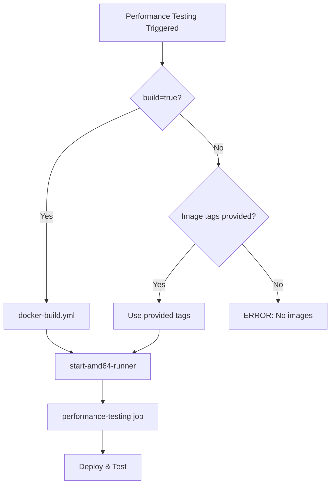

# Performance Testing Build Integration

## Overview

The `performance-testing.yml` workflow now supports conditional Docker image building, allowing you to either:
1. **Build fresh images** before running performance tests
2. **Use existing images** by providing image tags

## New Input: `build`

### Workflow Dispatch
When manually triggering the performance-testing workflow, you'll see a new `build` checkbox:

- **`build=true`**: Build fresh Docker images, then run performance tests
- **`build=false`** (default): Use the provided `kms_core_image_tag` and `kms_core_client_image_tag`

### Input Validation

The workflow validates that you have image tags available:
- If `build=false`, you **must** provide `kms_core_image_tag` and `kms_core_client_image_tag`
- If `build=true`, any provided image tags are **ignored** (fresh images are built)

## How It Works

### Architecture



### Job Flow

1. **docker-build** (conditional)
   - Runs if: `build=true` OR no image tags provided
   - Builds: golden-image → core-client + core-service → enclave
   - Outputs: image_tag, enclave_pcr0/1/2

2. **start-amd64-runner** (always)
   - Waits for docker-build (if running)
   - Starts EC2 runner for testing

3. **performance-testing** (always)
   - Uses docker-build outputs OR input tags
   - Deploys KMS infrastructure
   - Runs performance tests
   - Collects logs and artifacts

## Branch Selection

When manually triggering the workflow in GitHub Actions UI, you first **select which branch to run from**. This determines:

1. **Source code** for building images (when `build=true`)
2. **Workflow definition** that executes
3. **Default repository context**

### Important Notes

- **Images are built from the selected branch** when `build=true`
- **Charts can be from any branch/version** via `kms_chart_version` and `kms_branch`
- This allows testing different combinations:
  - Build from `feature-xyz`, test with chart from `main`
  - Build from `main`, test with chart from `feature-xyz`
  - Build from `feature-xyz`, test with chart from `feature-xyz` (full feature test)

### Branch Selection Flow

```
GitHub Actions UI
├─ Select branch: "feature-xyz"
├─ Click "Run workflow"
└─ Set inputs:
    ├─ build: true                    → Builds images from feature-xyz
    ├─ kms_chart_version: repository  → Uses chart from...
    └─ kms_branch: main              → ...main branch

Result: Tests feature-xyz code with main branch chart
```

## Usage Examples

### Example 1: Build and Test (Full CI)

```yaml
# Manual workflow dispatch
# IMPORTANT: Select the branch you want to build from in GitHub UI
# e.g., select "feature-xyz" to build images from that branch

inputs:
  build: true                              # ✓ Build fresh images from selected branch
  deployment_type: thresholdWithEnclave
  fhe_params: Test
  tls: true
  kms_branch: feature-xyz                  # ✓ Required when using repository chart
  kms_chart_version: repository            # Use chart from kms_branch
  tkms_infra_chart_version: 0.3.2
  # Image tags ignored when build=true
```

**Timeline:**
- 0:00 - Start docker-build
- 0:20 - Images built (golden-image)
- 0:40 - Images built (core-client, core-service)
- 1:00 - Enclave image built, PCRs extracted
- 1:00 - Start runner, begin performance tests
- ~1:30 - Tests complete

**Total: ~90 minutes**

### Example 2: Test Existing Images

```yaml
# Manual workflow dispatch
inputs:
  build: false                             # ✓ Use existing images
  deployment_type: thresholdWithEnclave
  fhe_params: Test
  tls: true
  kms_core_image_tag: sha-abc123def        # ✓ Must provide
  kms_core_client_image_tag: sha-abc123def # ✓ Must provide
  kms_chart_version: 1.4.17
  tkms_infra_chart_version: 0.3.2
```

**Timeline:**
- 0:00 - Start runner immediately (no build)
- 0:00 - Extract PCRs from existing image
- 0:05 - Begin performance tests
- ~0:35 - Tests complete

**Total: ~35 minutes** (saves ~55 minutes)

### Example 3: Called from docker-build.yml

```yaml
# docker-build.yml calls performance-testing
performance-testing:
  uses: ./.github/workflows/performance-testing.yml
  with:
    # build is omitted, so build=false implicitly
    kms_core_image_tag: ${{ needs.core-service.outputs.image_tag }}
    kms_core_client_image_tag: ${{ needs.core-client.outputs.image_tag }}
    deployment_type: thresholdWithEnclave
    # ... other parameters
```

**Behavior:** Uses the images just built by docker-build.yml

### Example 4: Cross-Branch Testing

```yaml
# Run from branch: feature-xyz (select in GitHub UI)
# Test: New code with stable chart
inputs:
  build: true                              # Build images from feature-xyz
  deployment_type: thresholdWithEnclave
  kms_chart_version: 1.4.17               # Use stable published chart
  kms_branch: ""                          # Not needed for versioned chart
```

**Use case:** Test new code changes with production chart version

### Example 5: Chart Development Testing

```yaml
# Run from branch: feature-new-chart (select in GitHub UI)
# Test: Stable code with new chart
inputs:
  build: false                             # Use existing stable images
  kms_core_image_tag: sha-stable123       # Stable image from main
  kms_core_client_image_tag: sha-stable123
  kms_chart_version: repository            # Use chart from selected branch
  kms_branch: feature-new-chart           # Chart under development
```

**Use case:** Test chart changes without rebuilding images

## Decision Logic

### When `build=true`

```bash
# Workflow executes:
1. docker-build job → Build all images
2. performance-testing job → Use docker-build outputs
   - KMS_CORE_IMAGE_TAG = needs.docker-build.outputs.image_tag
   - PCR0/1/2 = needs.docker-build.outputs.enclave_pcr0/1/2
```

### When `build=false` with tags

```bash
# Workflow executes:
1. docker-build job → SKIPPED
2. performance-testing job → Use input tags
   - KMS_CORE_IMAGE_TAG = inputs.kms_core_image_tag
   - PCR0/1/2 = Extracted from image labels
```

### When `build=false` without tags

```bash
# Workflow executes:
1. docker-build job → RUNS (fallback behavior)
2. performance-testing job → Use docker-build outputs
```

## Input Reference

### Required When `build=false`

| Input | Description | Example |
|-------|-------------|---------|
| `kms_core_image_tag` | Core service image tag | `sha-abc123def` |
| `kms_core_client_image_tag` | Core client image tag | `sha-abc123def` |

### Optional (behavior changes)

| Input | Default | Description |
|-------|---------|-------------|
| `build` | `false` | Build new images vs use existing |
| `deployment_type` | `threshold` | Deployment mode |
| `fhe_params` | `Test` | FHE parameter set |
| `tls` | `true` | Enable TLS |
| `kms_branch` | `""` | Branch to checkout (if using repository chart) |
| `kms_chart_version` | `1.4.17` | Chart version or `repository` |
| `tkms_infra_chart_version` | `0.3.2` | Infrastructure chart version |

## Error Handling

### Missing Image Tags

```
ERROR: No image tag available. Either build images or provide kms_core_image_tag
Exit code: 1
```

**Solution:** Either:
- Set `build=true`, OR
- Provide `kms_core_image_tag` and `kms_core_client_image_tag`

### PCR Extraction Failure (Enclave only)

If PCR values can't be extracted from docker-build outputs:
1. Workflow pulls the enclave image
2. Inspects image labels for PCR values
3. Falls back to manual extraction

## Integration with Other Workflows

### docker-build.yml

- **Trigger**: Schedule (nightly) or manual dispatch
- **Behavior**: Builds images, optionally calls performance-testing
- **Image Tags**: Passes to performance-testing via `outputs`

```yaml
performance-testing:
  uses: ./.github/workflows/performance-testing.yml
  with:
    kms_core_image_tag: ${{ needs.core-service.outputs.image_tag }}
    # build defaults to false, so uses these tags
```

### pr-ci.yml

Currently does **not** call performance-testing (only kind-testing and pr-preview).

Future enhancement could add:
```yaml
performance-testing:
  if: contains(github.event.pull_request.labels.*.name, 'perf-test')
  uses: ./.github/workflows/performance-testing.yml
  with:
    kms_core_image_tag: ${{ needs.docker-build.outputs.image_tag }}
```

## Benefits

### Time Savings
- **With build**: ~90 minutes (full build + test)
- **Without build**: ~35 minutes (test only)
- **Savings**: ~55 minutes when reusing images

### Flexibility
- Test the same images multiple times (different configs)
- Test older images for comparison
- Separate build from test for faster iteration

### Cost Efficiency
- Reuse images across multiple test runs
- Reduce runner costs by ~60% for repeat tests
- Parallel testing with same image tag

## Common Testing Patterns

### Pattern 1: Full Feature Testing
**Scenario:** Testing a complete feature (code + chart changes)

```yaml
Branch: feature-abc
build: true
kms_chart_version: repository
kms_branch: feature-abc
```
✅ Tests everything from the feature branch

### Pattern 2: Code-Only Testing
**Scenario:** Testing code changes with stable chart

```yaml
Branch: feature-abc
build: true
kms_chart_version: 1.4.17
```
✅ Tests new code with production chart

### Pattern 3: Chart-Only Testing
**Scenario:** Testing chart changes with stable code

```yaml
Branch: feature-chart-update
build: false
kms_core_image_tag: sha-abc123  # From main
kms_chart_version: repository
kms_branch: feature-chart-update
```
✅ Tests new chart with stable images

### Pattern 4: Configuration Testing
**Scenario:** Testing same code with different settings

```yaml
Branch: main
build: false
kms_core_image_tag: sha-abc123
# Run multiple times with different:
# - deployment_type
# - fhe_params
# - tls settings
```
✅ Reuses images for fast iteration

## Best Practices

### When to Use `build=true`
- ✅ Testing new code changes
- ✅ Nightly/scheduled performance testing
- ✅ Release candidate validation
- ✅ First test run of the day
- ✅ When `kms_chart_version: repository` is used

### When to Use `build=false`
- ✅ Re-testing same code with different configs
- ✅ Testing with TLS enabled vs disabled
- ✅ Comparing different FHE parameters
- ✅ Debugging performance issues (consistent baseline)
- ✅ Running tests on PR-built images
- ✅ Chart-only testing with stable code

## Migration Notes

### Before This Change
```yaml
# Only option: Always provide image tags
inputs:
  kms_core_image_tag: required
  kms_core_client_image_tag: required
```

### After This Change
```yaml
# Two options:
# Option 1: Build fresh
inputs:
  build: true

# Option 2: Use existing
inputs:
  build: false
  kms_core_image_tag: sha-abc123
  kms_core_client_image_tag: sha-abc123
```

### Backward Compatibility
✅ Existing workflow_call usages still work (build defaults to false)
✅ docker-build.yml integration unchanged
✅ All existing inputs preserved

## Troubleshooting

### Issue: "No image tag available"
**Cause:** `build=false` but no image tags provided  
**Solution:** Set `build=true` OR provide image tags

### Issue: Docker build takes too long
**Cause:** Building from scratch  
**Solution:** Use `build=false` with existing tags for faster tests

### Issue: PCR values don't match
**Cause:** Image tag and PCR values from different builds  
**Solution:** Use `build=true` to ensure consistency

## Future Enhancements

1. **Smart caching**: Detect if images exist for current commit
2. **Matrix testing**: Test multiple configs in parallel with same images
3. **Performance comparison**: Compare results across builds automatically
4. **Auto-cleanup**: Clean up old images after tests complete
