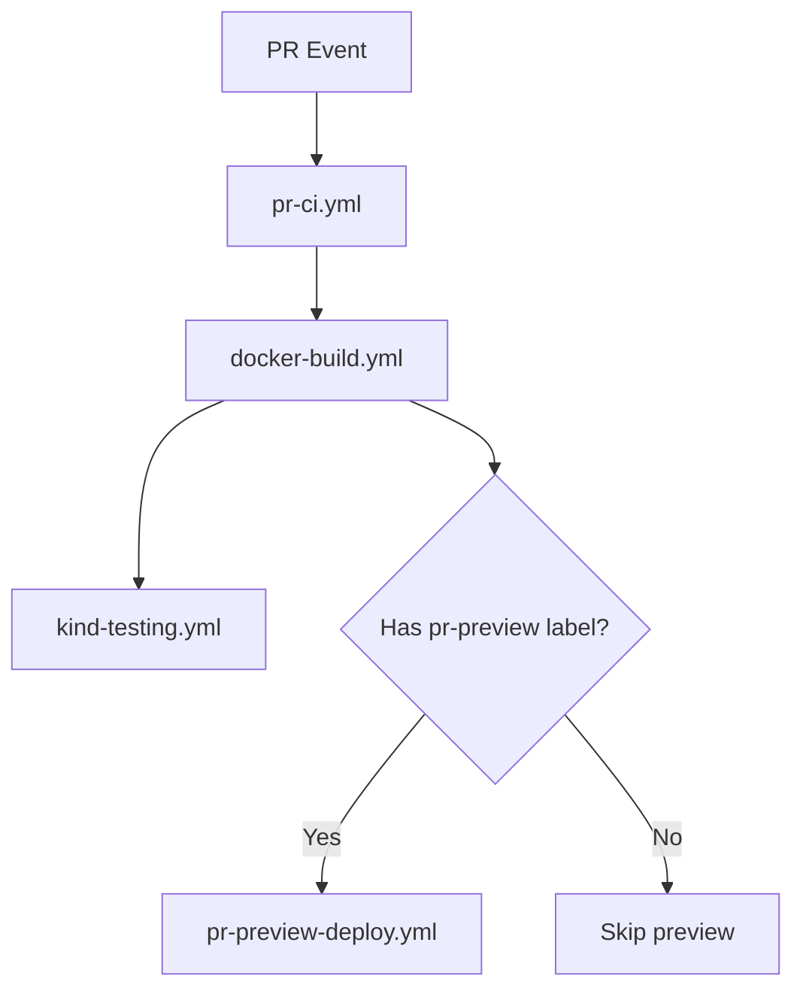

# PR CI Workflow Refactoring

## Overview

This refactoring consolidates Docker image builds for pull requests to ensure images are built **once** and shared across all dependent workflows, saving approximately 20-30 minutes per PR.

## Problem Statement

Previously, both `kind-testing.yml` and `pr-preview-deploy.yml` independently called `docker-build.yml` on every pull request, resulting in:
- Duplicate image builds (same commit, same images, built twice)
- Increased CI time and cost
- Potential version mismatches if builds happened at different times

## Solution: Orchestrator Pattern

### New Workflow: `pr-ci.yml`

A new orchestrator workflow (`pr-ci.yml`) that:
1. **Builds images once** using `docker-build.yml`
2. **Passes image tags** to dependent workflows
3. **Runs tests in parallel** after build completes
4. **Conditionally deploys** PR preview based on labels

### Workflow Modifications

#### 1. `pr-ci.yml` (NEW)
- **Trigger**: Pull request events
- **Jobs**:
  - `docker-build`: Builds all images once
  - `kind-testing`: Runs Kind tests with pre-built images
  - `check-pr-preview-labels`: Determines deployment type from labels
  - `pr-preview`: Deploys preview if PR has `pr-preview-*` label

#### 2. `kind-testing.yml` (MODIFIED)
- **Removed**: `on: pull_request` trigger (now called by `pr-ci.yml`)
- **Added**: `workflow_call` trigger with `image_tag` input
- **Modified**: `docker-build` job now only runs when `image_tag` is not provided (for scheduled runs)
- **Kept**: `schedule` trigger for nightly builds (still builds its own images)

#### 3. `pr-preview-deploy.yml` (MODIFIED)
- **Removed**: `on: pull_request` trigger (now called by `pr-ci.yml`)
- **Added**: `workflow_call` trigger with inputs:
  - `deployment_type`: Extracted from PR label
  - `pr_number`: Used for namespace generation
  - `image_tag`: Pre-built image tag
  - `enclave_pcr0/1/2`: PCR values for enclave deployments
- **Modified**: Uses input values instead of detecting from PR labels

## Benefits

### Time Savings
- **Before**: ~40-60 minutes (2 builds × 20-30 min each)
- **After**: ~20-30 minutes (1 build)
- **Savings**: ~20-30 minutes per PR

### Resource Efficiency
- Single build per commit
- Parallel test execution after build
- Reduced runner costs

### Consistency
- Same image tag used across all workflows
- Eliminates potential version mismatches
- Easier debugging (one build to troubleshoot)

## Usage

### For Regular PRs
No changes needed! Opening a PR will:
1. Build images once
2. Run Kind tests automatically

### For PR Previews
Add a label to your PR:
- `pr-preview-threshold`: Deploy threshold preview
- `pr-preview-centralized`: Deploy centralized preview
- `pr-preview-thresholdWithEnclave`: Deploy threshold with enclave
- `pr-preview-centralizedWithEnclave`: Deploy centralized with enclave

The orchestrator will:
1. Build images (if not already built)
2. Run tests
3. Deploy preview to AWS

### For Scheduled Builds
No changes! Scheduled runs still work:
- `kind-testing.yml` runs nightly and builds its own images
- `docker-build.yml` runs nightly and can optionally trigger performance testing

## Migration Notes

### What Changed
1. **PR trigger removed** from `kind-testing.yml` and `pr-preview-deploy.yml`
2. **New orchestrator** `pr-ci.yml` handles all PR workflows
3. **Workflows now reusable** via `workflow_call`

### What Didn't Change
- Scheduled builds still work as before
- Manual workflow dispatch still works
- `docker-build.yml` remains the single source of truth for image building
- Test behavior is identical

### Backward Compatibility
- Old workflows continue to work for scheduled/manual runs
- No changes needed to PR workflow for developers
- Label-based preview deployment works the same

## Testing the Refactoring

1. **Open a test PR** without any labels
   - Should build images once
   - Should run Kind tests for threshold and centralized

2. **Add `pr-preview-threshold` label**
   - Should reuse existing images
   - Should deploy preview
   - Should post preview instructions as PR comment

3. **Push new commit**
   - Should cancel previous run
   - Should build new images
   - Should run tests and preview (if labeled)

## Performance Testing Integration

The `performance-testing.yml` workflow already accepts pre-built image tags:
- Called by `docker-build.yml` with `build=true` 
- Can be called manually with existing image tags
- No changes needed for this refactoring

## Troubleshooting

### Issue: "image_tag is empty"
**Cause**: `docker-build` job didn't run or failed  
**Solution**: Check docker-build job logs in pr-ci workflow

### Issue: "No KMS party found"
**Cause**: Crossplane resources not ready (separate issue, being fixed)  
**Solution**: The `deploy_unified.sh` script now waits for crossplane resources

### Issue: "PR preview not deploying"
**Cause**: Missing or incorrect label  
**Solution**: Ensure PR has exactly one `pr-preview-*` label

## Future Improvements

1. **Smart caching**: Skip builds if code hasn't changed
2. **Artifact sharing**: Use GitHub artifacts instead of container registry
3. **Matrix preview**: Deploy multiple preview types simultaneously
4. **Auto-cleanup**: Remove preview deployments after PR close

## Related Files

- `.github/workflows/pr-ci.yml` - Main orchestrator
- `.github/workflows/kind-testing.yml` - Kind tests (reusable)
- `.github/workflows/pr-preview-deploy.yml` - Preview deployment (reusable)
- `.github/workflows/docker-build.yml` - Image builder (unchanged)
- `.github/workflows/performance-testing.yml` - Performance tests (unchanged)
