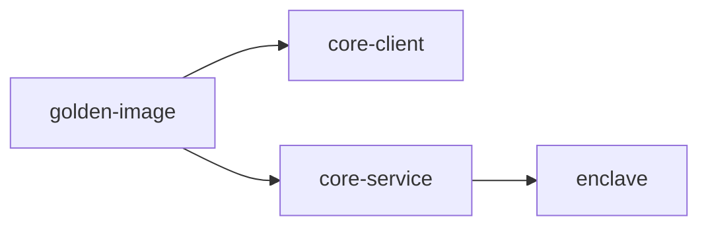

# 🚀 KMS Core CI/CD Workflows

> A comprehensive guide to our CI/CD pipeline structure and automation

## 📋 Overview

This document describes the CI/CD workflow structure for the KMS Core project. Our pipeline is designed to ensure code quality, run comprehensive tests, and automate releases through intelligent change detection, parallel execution, and efficient Docker image reuse.

## 🔄 Workflow Architecture

```
Pull Request
    │
    ├─→ build-and-test.yml (Orchestrator)
    │   ├─→ docker-build.yml (Build Once)
    │   │   └─→ Outputs: image_tag, pcr0, pcr1, pcr2
    │   │
    │   ├─→ kind-testing.yml (Uses pre-built images)
    │   │   └─→ Uses: deploy.sh script
    │   │
    │   └─→ pr-preview-deploy.yml (Uses pre-built images)
    │       └─→ Uses: deploy.sh script
    │
    └─→ main.yml (Change Detection & Testing)
        └─→ Component-specific tests

Schedule (Nightly)
    ├─→ main.yml (Full test suite)
    ├─→ kind-testing.yml (Builds own images)
    └─→ performance-testing.yml
        ├─→ docker-build.yml (Fresh build)
        └─→ AWS deployment (deploy.sh script)

Release
    └─→ docker-build.yml (Release build)
        └─→ Publishes to registries
```

---

## 📚 Quick Reference

### Key Workflows

| Workflow | Purpose | Triggers |
|----------|---------|----------|
| [`build-and-test.yml`](build-and-test.yml) | PR CI orchestrator | PRs (opened, labeled, synchronize) |
| [`main.yml`](main.yml) | Component testing & change detection | PRs, pushes, nightly |
| [`docker-build.yml`](docker-build.yml) | Reusable Docker build | Called by other workflows, releases |
| [`kind-testing.yml`](kind-testing.yml) | Kind cluster integration tests | Called by build-and-test, nightly |
| [`performance-testing.yml`](performance-testing.yml) | Performance benchmarks | Manual, nightly |
| [`pr-preview-deploy.yml`](pr-preview-deploy.yml) | Ephemeral PR environments | Called by build-and-test |
| [`pr-preview-destroy.yml`](pr-preview-destroy.yml) | Cleanup PR environments | PR close, label removal, nightly |

### Deployment Targets

| Target | Purpose | Used By |
|--------|---------|---------|
| `kind-local` | Local development | Kind testing, manual testing |
| `kind-ci` | CI testing | Kind testing workflow |
| `aws-ci` | PR preview environments | PR preview workflow |
| `aws-perf` | Performance testing | Performance testing workflow |

### Deployment Scripts

| Script | Purpose | Lines |
|--------|---------|-------|
| [`ci/scripts/deploy.sh`](../../ci/scripts/deploy.sh) | Main entry point | 146 |
| [`ci/scripts/lib/common.sh`](../../ci/scripts/lib/common.sh) | Logging & utilities | 277 |
| [`ci/scripts/lib/context.sh`](../../ci/scripts/lib/context.sh) | K8s context setup | 87 |
| [`ci/scripts/lib/infrastructure.sh`](../../ci/scripts/lib/infrastructure.sh) | Infrastructure deployment | 316 |
| [`ci/scripts/lib/kms_deployment.sh`](../../ci/scripts/lib/kms_deployment.sh) | KMS Core deployment | 546 |
| [`ci/scripts/lib/utils.sh`](../../ci/scripts/lib/utils.sh) | Port forwarding & logs | 165 |

---

## 🏗️ PR CI Orchestrator

[`.github/workflows/build-and-test.yml`](build-and-test.yml)

The main PR workflow that orchestrates Docker builds and testing for pull requests.

### Key Benefits
- ✅ **Single image build per PR** - Saves ~20-30 minutes per PR
- ✅ **Consistent image tags** - Same images across all dependent workflows
- ✅ **Parallel execution** - Tests run in parallel after build completes
- ✅ **Smart orchestration** - Coordinates Kind testing and PR previews

### Trigger Types

| Trigger | Timing | Purpose |
|---------|--------|---------|
| 🔍 **Pull Requests** | opened, labeled, synchronize, reopened | Orchestrates builds and tests |

### Jobs

| Job | Purpose | Dependencies |
|-----|---------|--------------|
| **docker-build** | Builds Docker images once for entire PR | None |
| **kind-testing** | Runs Kind cluster tests with pre-built images | docker-build |
| **check-pr-preview-labels** | Determines if PR preview should deploy | None |
| **pr-preview** | Deploys ephemeral preview environment | docker-build, check-pr-preview-labels |

### Concurrency Control
- Groups by PR head ref
- Cancels in-progress runs when new commits pushed

---

## 🔄 Main Workflow File

[`.github/workflows/main.yml`](main.yml)

### Trigger Types

| Trigger | Timing | Purpose |
|---------|--------|---------|
| 🌙 **Scheduled (Nightly)** | Every weekday at 00:00 UTC | Comprehensive testing with nightly test suites |
| 🔍 **Pull Requests** | On PR creation/update | Code validation & testing based on changes |
| 🎯 **Main/Release** | On push to main/release/* | Testing & conditional Docker builds |
| 🏷️ **Docker Label** | On PR with "docker" label | Triggers Docker image builds |

---

## 🏗️ Component-Specific Jobs

### 🔍 Change Detection System
Our CI uses intelligent change detection to only run tests for modified components:
- **Path-based filtering**: Only runs jobs when relevant files change
- **Concurrent execution**: Jobs run in parallel when triggered
- **Dependency awareness**: Core changes trigger dependent component tests

### 📦 Helm Chart Component
<details>
<summary><b>View Component Details</b></summary>

#### 🧪 Test Job [`test-helm-chart`](main.yml)
| Trigger | Status | Condition |
|---------|--------|-----------|
| 🔍 PR | ✅ | On charts/** changes |
| 🎯 Main | ✅ | On charts/** changes |

#### 🔍 Lint Job [`lint-helm-chart`](main.yml)
| Trigger | Status | Condition |
|---------|--------|-----------|
| 🔍 PR | ✅ | On charts/** changes |
| 🎯 Main | ✅ | On charts/** changes |

#### 📦 Release Job [`release-helm-chart`](main.yml)
| Trigger | Status | Condition |
|---------|--------|-----------|
| 🎯 Main | ✅ | On charts/** changes (non-scheduled) |
</details>

### 📚 Documentation Component
<details>
<summary><b>View Component Details</b></summary>

#### 🔍 Check Job [`check-docs`](main.yml)
| Trigger | Status | Condition |
|---------|--------|-----------|
| 🔍 PR | ✅ | On docs/** changes |
| 🎯 Main | ✅ | Always runs |

> Performs link checking and validation using Python's linkcheckmd
</details>

### 🔄 Backward Compatibility Testing
<details>
<summary><b>View Component Details</b></summary>

#### 🧪 Test Job [`test-backward-compatibility`](main.yml)
| Trigger | Status | Condition |
|---------|--------|-----------|
| 🔍 PR | ✅ | On core service/threshold/grpc/CI changes |
| 🎯 Main | ✅ | Always runs |

> Uses big instance for comprehensive backward compatibility validation
</details>

### 📱 Core Client Component
<details>
<summary><b>View Component Details</b></summary>

#### 🧪 Integration Tests [`test-core-client`](main.yml)
| Trigger | Status | Condition |
|---------|--------|-----------|
| 🔍 PR | ✅ | On core-client/service/threshold/grpc/CI changes |
| 🎯 Main | ✅ | Always runs |

**Test Matrix**: Runs threshold and centralized tests in parallel

#### 🔬 Unit Tests [`test-core-client-unit`](main.yml)
| Trigger | Status | Condition |
|---------|--------|-----------|
| 🔍 PR | ✅ | On core-client/** changes only |
| 🎯 Main | ❌ | Skip integration tests |

#### 🐳 Docker Build [`docker-core-client`](main.yml)
| Trigger | Status | Condition |
|---------|--------|-----------|
| 🔍 PR | ✅ | When labeled with "docker" |
| 🎯 Main | ❌ | Manual trigger only |
</details>

### 🌐 GRPC Component
<details>
<summary><b>View Component Details</b></summary>

#### 🧪 Test Job [`test-grpc`](main.yml)
| Trigger | Status | Condition |
|---------|--------|-----------|
| 🔍 PR | ✅ | On core/grpc/** changes |
| 🎯 Main | ✅ | On core/grpc/** changes |

> Tests all features using big instance infrastructure
</details>

### ⚙️ Core Service Component
<details>
<summary><b>View Component Details</b></summary>

#### 🧪 Test Job [`test-core-service`](main.yml)
| Trigger | Status | Condition |
|---------|--------|-----------|
| 🔍 PR | ✅ | On core/service/** changes |
| 🎯 Main | ✅ | On core/service/** changes |

##### Test Matrix Configuration
- 🌙 **Nightly Tests**: `--release -F slow_tests -F s3_tests -F insecure nightly`
- 🔍 **PR/Main Tests** (4 parallel jobs):
  1. **Library Tests**: `-F testing --lib`
  2. **Default User Decryption**: `-F slow_tests -F s3_tests -F insecure default_user_decryption_threshold`
  3. **Threshold Tests**: `-F slow_tests -F s3_tests -F insecure threshold` (excludes default_user_decryption)
  4. **Base Tests**: `-F slow_tests -F s3_tests -F insecure` (excludes threshold tests)

> **Infrastructure**: Uses big instance with MinIO and WASM support

#### 🌐 WASM Tests [`test-wasm`](main.yml)
| Trigger | Status | Condition |
|---------|--------|-----------|
| 🔍 PR | ✅ | On core/service/** changes |
| 🎯 Main | ✅ | On core/service/** changes |

#### 🐳 Docker Build [`docker-core-service`](main.yml)
| Trigger | Status | Condition |
|---------|--------|-----------|
| 🔍 PR | ✅ | When labeled with "docker" |
| 🎯 Main | ❌ | Manual trigger only |

#### 🛡️ Nitro Enclave [`docker-nitro-enclave`](main.yml)
| Trigger | Status | Condition |
|---------|--------|-----------|
| 🔍 PR | ✅ | When labeled with "docker" (after core service) |
| 🎯 Main | ❌ | Manual trigger only |
</details>

### 🔐 Threshold Component
<details>
<summary><b>View Component Details</b></summary>

#### 🧪 PR Tests [`test-core-threshold-pr`](main.yml)
| Trigger | Status | Condition |
|---------|--------|-----------|
| 🔍 PR | ✅ | On core/threshold/** changes |
| 🎯 Main | ❌ | PR only |

> **Config**: `-F slow_tests --lib` with 4 parallel test threads

#### 🧪 Main Tests [`test-core-threshold-main`](main.yml)
| Trigger | Status | Condition |
|---------|--------|-----------|
| 🔍 PR | ❌ | Never runs |
| 🎯 Main | ✅ | On core/threshold/** changes |

> **Config**: `-F slow_tests --lib` with Redis integration and 4 parallel test threads

#### 🤖 Dependabot Build [`build-dependabot`](main.yml)
| Trigger | Status | Condition |
|---------|--------|-----------|
| 🔍 PR | ✅ | Only for dependabot/** branches |
| 🎯 Main | ❌ | Dependabot only |

> **Simplified**: `--lib` tests only for dependency validation
</details>

### 🏗️ Infrastructure Components
<details>
<summary><b>View Component Details</b></summary>

#### 🐳 Golden Image [`docker-golden-image`](main.yml)
| Trigger | Status | Condition |
|---------|--------|-----------|
| 🔍 PR | ✅ | When labeled with "docker" |
| 🎯 Main | ❌ | Manual trigger only |

> **Purpose**: Builds base Rust image with dependencies for KMS components

#### 📊 Test Reporter [`test-reporter`](main.yml)
| Trigger | Status | Condition |
|---------|--------|-----------|
| 🔍 PR | ✅ | Always runs after all tests complete |
| 🎯 Main | ❌ | PR only |

> **Function**: Aggregates and reports test results from all components
</details>

---

## 🐳 Docker Build Infrastructure

### Reusable Docker Build Workflow
[`.github/workflows/docker-build.yml`](docker-build.yml)

A reusable workflow that builds all KMS Docker images in a coordinated pipeline.

#### Trigger Types

| Trigger | Purpose |
|---------|---------|
| 🏷️ **Release** | Builds images when GitHub release is published |
| 🔄 **Workflow Call** | Called by other workflows (PR CI, performance testing, etc.) |

#### Build Pipeline

Sequential build process with dependency management:



| Job | Image | Dependencies | Runner |
|-----|-------|--------------|--------|
| **golden-image** | `kms/rust-golden-image` | None | 64cpu (x64/arm64) |
| **core-client** | `kms/core-client` | golden-image | 64cpu (x64/arm64) |
| **core-service** | `kms/core-service` | golden-image | 64cpu (x64/arm64) |
| **enclave** | `kms/core-service-enclave` | core-service | AMD64 only |

#### Features
- 🏗️ **Multi-architecture**: Builds for AMD64 and ARM64
- 🔐 **Security**: OIDC authentication, build attestations
- 📦 **Dual Publishing**: GHCR and CGR registries
- ⚡ **Caching**: S3-backed cache with 200GB volumes
- 📤 **Outputs**: Returns `image_tag` and enclave PCR values

---

## 🚀 Release Workflows

### 1. 📦 NPM Release
[`.github/workflows/npm-release.yml`](npm-release.yml)

| Trigger | Status | Condition |
|---------|--------|-----------|
| 🏷️ Release | ✅ | When GitHub release is published |

#### Features
- 🌐 **Dual Package Build**: Creates separate Node.js and web WASM packages
- 📝 **Package Variants**:
  - `node-tkms`: Node.js target with `--target nodejs`
  - `tkms`: Web target with `--target web`
- 🔄 **Version Tagging**: Automatic latest/prerelease tag assignment
- 🔐 **Security**: Uses [NPM trusted publishers](https://docs.npmjs.com/trusted-publishers) for authentication

### 2. 🐳 Release Docker Images
[`.github/workflows/release.yml`](release.yml)

| Trigger | Status | Condition |
|---------|--------|-----------|
| 🏷️ Release | ✅ | When GitHub release is published |
| 🔄 Manual | ✅ | Via workflow_dispatch (configurable ref) |

#### Features
- Calls the reusable `docker-build.yml` workflow
- Publishes images with release tags
- Creates build attestations for supply chain security

---

## 🔍 Quality Assurance Workflows

### 1. 🧹 CI Lint and Security
[`.github/workflows/ci_lint.yml`](ci_lint.yml)

| Trigger | Status | Condition |
|---------|--------|-----------|
| 🔍 PR | ✅ | Always runs |

#### Features
- 🔄 **Concurrency Control**: Auto-cancels for non-main branches
- 🛠️ **Workflow Validation**: Uses `actionlint` v1.6.27
- 🔒 **Security Enforcement**: SHA-pinned actions validation
- 🔍 **SAST Analysis**: Static security scanning with Zizmor

### 2. 📦 Dependencies Analysis
[`.github/workflows/dependencies_analysis.yml`](dependencies_analysis.yml)

| Trigger | Status | Condition |
|---------|--------|-----------|
| 🔍 PR | ✅ | All branches |
| 🎯 Push | ✅ | main, test branches |

#### Features
- 🔄 **Concurrency Control**: Auto-cancels for non-main branches
- 🦀 **Rust Toolchain**: Uses stable Rust with efficient tool installation
- 📝 **Cargo.lock Validation**: Ensures lock file integrity
- 🔐 **Security Scanning**:
  - **License Compliance**: `cargo-deny` v0.18.9 for license whitelist
  - **Vulnerability Detection**: `cargo-audit` v0.22.0 for security issues
- 🚀 **Efficient Installation**: Uses `cargo-binstall` for faster tool setup

---

## ☸️ Kubernetes Integration Testing
[`.github/workflows/kind-testing.yml`](kind-testing.yml)

| Trigger | Timing | Purpose |
|---------|--------|---------|
| 🔄 **Workflow Call** | Called from build-and-test.yml | Runs integration tests with pre-built images |
| 🌙 **Scheduled** | Mon-Fri 00:00 UTC | Nightly integration checks (builds own images) |

### Smart Image Handling
- **PR Workflow**: Uses pre-built images from `docker-build` (via `image_tag` input)
- **Scheduled**: Builds fresh images at workflow start
- **Conditional Build**: Docker build job only runs when `image_tag` input is empty

### Matrix Configuration
- **Check**: Code linting and formatting
- **Threshold**: 4-party deployment tests
- **Centralized**: Single-party deployment tests

### Deployment Script
Uses modular `ci/scripts/deploy.sh` which handles:
- ✅ Kubernetes context setup (Kind cluster creation)
- ✅ Infrastructure deployment (LocalStack, TKMS, Crossplane)
- ✅ Image building and loading (when `--build` flag used)
- ✅ KMS deployment with automatic waiting
- ✅ Port forwarding setup

---

## 👁️ PR Preview Environments
The system allows deploying ephemeral Kubernetes environments for PRs.

### 🚀 Deploy Preview
[`.github/workflows/pr-preview-deploy.yml`](pr-preview-deploy.yml)

**New Workflow**: Now called from `build-and-test.yml` orchestrator with pre-built images.

#### Trigger
- Called by `build-and-test.yml` when PR has both:
  1. Images built (from docker-build job)
  2. Preview label (`pr-preview-*`)

#### Deployment Types
- `pr-preview-threshold`: Deploys 4-party threshold mode
- `pr-preview-centralized`: Deploys single-party centralized mode
- `pr-preview-thresholdWithEnclave`: Threshold mode with Nitro Enclave support
- `pr-preview-centralizedWithEnclave`: Centralized mode with Nitro Enclave support

#### Features
- Uses pre-built images from `build-and-test.yml`
- Receives enclave PCR values as inputs
- Deploys to `kms-ci-{actor}-{pr_number}` namespace
- Uses modular deployment script (`ci/scripts/deploy.sh`)

### 🗑️ Destroy Preview
[`.github/workflows/pr-preview-destroy.yml`](pr-preview-destroy.yml)

Automatically cleans up resources when:
1. PR is closed
2. Preview label is removed
3. 🌙 Nightly schedule (cleanup of stale namespaces)

---

## 📊 Performance Testing

[`.github/workflows/performance-testing.yml`](performance-testing.yml)

Comprehensive performance testing workflow for KMS deployments.

### Trigger Types

| Trigger | Timing | Purpose |
|---------|--------|---------|
| 🌙 **Scheduled** | Mon-Fri 00:00 UTC | Nightly performance benchmarks |
| 🔄 **Manual Dispatch** | On demand | Ad-hoc performance testing with custom parameters |

### Workflow Parameters

| Parameter | Options | Purpose |
|-----------|---------|---------|
| **build** | true/false | Build fresh images or use existing tags |
| **deployment_type** | threshold, thresholdWithEnclave, centralized, centralizedWithEnclave | Deployment mode |
| **fhe_params** | Default, Test | FHE parameter set for testing |
| **tls** | true/false | Enable TLS (for enclave deployments) |
| **kms_branch** | branch name | Use specific KMS branch |
| **kms_chart_version** | version or 'repository' | Helm chart version |
| **tkms_infra_chart_version** | version | Infrastructure chart version |

### Jobs

#### 1. Docker Build (Conditional)
- Only runs when `build=true` or on schedule
- Calls reusable `docker-build.yml` workflow
- Outputs image tags and PCR values for deployment

#### 2. Performance Test Execution
- Uses `aws-perf` target for production-like environment
- Deploys 13-party threshold mode for stress testing
- Uses modular `ci/scripts/deploy.sh` script

### Deployment Script Benefits
The workflow now uses `ci/scripts/deploy.sh` which:
- ✅ **Handles all waiting internally** - No manual kubectl waits in workflow
- ✅ **Waits for TKMS infrastructure** - Crossplane resources, KMS parties, enclave nodegroups
- ✅ **Waits for KMS Core pods** - All parties ready before proceeding
- ✅ **Waits for initialization jobs** - Threshold mode setup completion
- ✅ **Single deployment command** - Simplified workflow with all logic in script

#### What Changed
**Before**: Workflow had ~70 lines of manual waiting logic
```yaml
- name: Wait tkms-infra to be ready
- name: Wait for KMS Core pods to be ready
- name: Wait for KMS Core initialization to complete
```

**After**: Single deployment command, script handles everything
```yaml
- name: Deploy KMS using unified script
  run: ./ci/scripts/deploy.sh --target aws-perf ...
  # Script handles all waiting internally!
```

---

## 🛠️ Reusable Workflow Infrastructure

### 1. 🖥️ Big Instance Testing
[`.github/workflows/common-testing-big-instance.yml`](common-testing-big-instance.yml)

#### Architecture
- 🚀 **EC2 Runner Management**: Uses Zama SLAB for dynamic runner provisioning
- 🔄 **Workflow Delegation**: Proxies to `common-testing.yml` with enhanced resources
- 🛑 **Guaranteed Cleanup**: Always stops runners even on failure

#### Supported Services
- **MinIO**: Object storage testing (`run-minio: true`)
- **Redis**: Caching and state testing (`run-redis: true`)
- **WASM Runtime**: WebAssembly execution testing (`run-wasm: true`)

### 2. 🏗️ Common Testing Pipeline
[`.github/workflows/common-testing.yml`](common-testing.yml)

#### Pipeline Stages
| Stage | Actions | Key Features |
|-------|---------|--------------|
| 🔧 **Setup** | Checkout, Git LFS, Registry login | Multi-registry support (GHCR, CGR) |
| 🌍 **Environment** | Rust toolchain, Protoc, Dependencies | Version-pinned from `rust-toolchain.toml` |
| 🗄️ **Caching** | Cargo cache, Build artifacts | S3-backed caching with runs-on/cache |
| ✨ **Quality** | Formatting, Clippy, Dylint | Multiple lint passes (default + all features) |
| 🧪 **Testing** | Nextest execution, Artifact collection | Configurable parallelism and retries |
| 📚 **Documentation** | Doc building and deployment | Optional GitHub Pages publication |

#### Advanced Testing Features
- **Nextest Integration**: Modern test runner with better output
- **Test Parallelism**: Configurable via `nextest-test-threads`
- **Retry Logic**: `NEXTEST_RETRIES: 3` for flaky test handling
- **Artifact Collection**: JUnit XML and log preservation
- **Slack Integration**: Nightly test result notifications

### 3. 🌐 WASM Testing Pipeline
[`.github/workflows/wasm-testing.yml`](wasm-testing.yml)

#### Specialized WASM Workflow
- **Test Generation**: Runs Rust tests to create WASM test fixtures
- **WASM Pack Build**: Creates Node.js WASM packages
- **Node.js Testing**: Validates WASM functionality with `node --test`
- **Dry-run Publishing**: Tests NPM package creation without actual publish

### 4. 🐳 Specialized Docker Workflows
- **Nitro Enclave**: [`common-nitro-enclave.yml`](common-nitro-enclave.yml) - AWS secure execution
- **ArgoCD Updates**: [`common-update-argocd.yml`](common-update-argocd.yml) - Staging deployments
- **Docker Check Build**: [`docker-check-build.yml`](docker-check-build.yml) - Validate Docker builds without publishing
- **Docker Scan**: [`docker-scan.yml`](docker-scan.yml) - Security scanning for container images

---

## 🔧 Deployment Scripts

### Modular Deployment Infrastructure
[`ci/scripts/`](../../ci/scripts/)

The deployment scripts have been refactored into a modular structure for better maintainability.

#### Main Entry Point
[`ci/scripts/deploy.sh`](../../ci/scripts/deploy.sh) - Orchestrates entire deployment

#### Library Modules
- [`lib/common.sh`](../../ci/scripts/lib/common.sh) - Logging, argument parsing, utilities
- [`lib/context.sh`](../../ci/scripts/lib/context.sh) - Kubernetes context setup
- [`lib/infrastructure.sh`](../../ci/scripts/lib/infrastructure.sh) - LocalStack, TKMS, Crossplane
- [`lib/kms_deployment.sh`](../../ci/scripts/lib/kms_deployment.sh) - KMS Core deployment
- [`lib/utils.sh`](../../ci/scripts/lib/utils.sh) - Port forwarding, log collection

#### Key Features
- ✅ **Modular design** - 143-line entry point vs 1,400+ monolithic
- ✅ **Automatic waiting** - Handles all Kubernetes resource readiness
- ✅ **Smart context management** - Kind, AWS-CI, AWS-Perf targets
- ✅ **Build support** - Local image building with Kind
- ✅ **Infrastructure automation** - S3, TKMS, Crossplane deployment

#### Usage in Workflows

**Kind Testing**:
```bash
./ci/scripts/deploy.sh --target kind-local --build
```

**Performance Testing**:
```bash
./ci/scripts/deploy.sh \
  --target aws-perf \
  --namespace "${NAMESPACE}" \
  --deployment-type "${DEPLOYMENT_TYPE}" \
  --core-tag "${KMS_CORE_IMAGE_TAG}" \
  --client-tag "${KMS_CORE_CLIENT_IMAGE_TAG}" \
  --num-parties 13
```

**PR Preview**:
```bash
./ci/scripts/deploy.sh \
  --target aws-ci \
  --namespace "kms-ci-${ACTOR}-${PR_NUMBER}" \
  --deployment-type "${DEPLOYMENT_TYPE}"
```

See [`ci/scripts/README.md`](../../ci/scripts/README.md) for complete documentation.

---

## 💡 Best Practices

### Working with PR Workflows

#### To Test Your Changes
1. **Open a PR** - Workflows run automatically
2. **For PR preview** - Add:
   - `pr-preview-{type}` label (deploys environment)

#### Choosing Deployment Type
- `pr-preview-threshold`: 4-party threshold (fastest, most common)
- `pr-preview-centralized`: Single-party (quick testing)
- `pr-preview-thresholdWithEnclave`: Enclave security (slower, AWS Nitro)
- `pr-preview-centralizedWithEnclave`: Centralized with enclave

### Deployment Scripts

```bash
./ci/scripts/deploy.sh --target aws-perf --deployment-type threshold
# Script handles everything: setup, deploy, wait, verify
```

---

## 🐛 Troubleshooting

### Common Issues

#### Docker Build Fails with Cache Errors
**Symptom**: Build fails with S3 cache errors
**Solution**: Check AWS credentials and S3 bucket access

#### PR Preview Won't Deploy
**Check**:
1. Does PR have `pr-preview-*` label? (triggers deploy)
2. Check `build-and-test` workflow logs

#### Kind Tests Fail to Load Images
**Symptom**: Pods stuck in `ImagePullBackOff`
**Solution**:
- Check if `docker-build` job completed successfully
- Verify image tag is passed correctly to Kind testing
- For local testing, use `--build` flag to build images

#### Deployment Script Hangs
**Symptom**: Script appears stuck waiting for resources
**Common causes**:
1. **Crossplane not ready**: Wait for crossplane-system pods
2. **TKMS chart issues**: Check helm releases
3. **Resource limits**: Insufficient cluster resources

**Debug**:
```bash
# Check what's happening
kubectl get all -n ${NAMESPACE}
kubectl describe pod <pod-name> -n ${NAMESPACE}

# Check logs
kubectl logs <pod-name> -n ${NAMESPACE}
```

#### Enclave Deployment Fails
**Symptom**: PCR validation fails or enclave won't start
**Check**:
1. PCR values passed correctly from docker-build
2. Enclave nodegroup created (takes ~20 minutes)
3. TLS enabled for enclave deployments

### Debugging Workflows

#### Enable Debug Logging
Add to workflow run:
```yaml
env:
  ACTIONS_STEP_DEBUG: true
  ACTIONS_RUNNER_DEBUG: true
```

#### Check Deployment Script Output
```bash
# Enable verbose mode
bash -x ci/scripts/deploy.sh --target kind-local 2>&1 | tee debug.log
```

#### Access PR Preview Environment
1. Check PR comment for Tailscale instructions
2. Connect via Tailscale
3. Use `kubectl` with provided namespace:
```bash
kubectl get all -n kms-ci-{actor}-{pr_number}
```

---

## 📖 Additional Resources

- [Deployment Scripts README](../../ci/scripts/README.md) - Detailed script documentation
- [Performance Testing Build README](README-performance-testing-build.md) - Performance testing deep dive
- [Helm Charts](../../charts/) - KMS Helm chart documentation
- [Docker Files](../../docker/) - Dockerfile documentation

---
