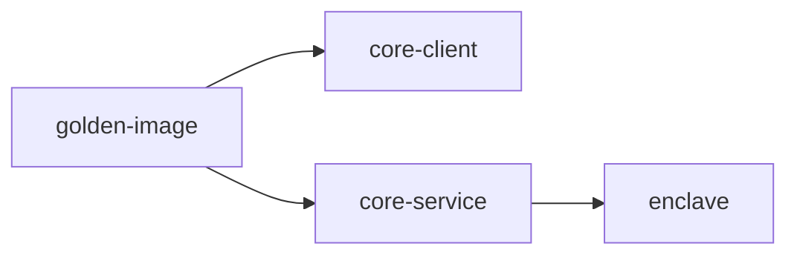
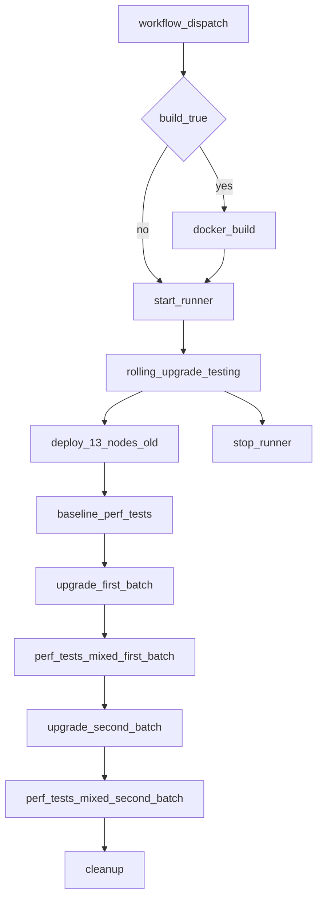

# KMS Core CI/CD Workflows

CI/CD for KMS Core. Built around path-based change detection (`dorny/paths-filter`), reusable composite workflows, and shared deployment scripts under `ci/scripts/`.

## Workflow Architecture

```
Pull Request
    ├─→ build-and-test.yml (Orchestrator)
    │   ├─→ docker-build.yml (build once → image_tag, pcr0, pcr1, pcr2)
    │   ├─→ kind-testing.yml (uses pre-built images)
    │   └─→ pr-preview-deploy.yml (uses pre-built images)
    │
    └─→ main.yml (change detection → component-specific tests)

Schedule (weekdays 00:00 UTC)
    ├─→ main.yml (nightly suites)
    ├─→ kind-testing.yml (builds own images)
    └─→ performance-testing.yml

Release
    └─→ docker-build.yml (publishes to GHCR + CGR)
```

## Quick Reference

### Key Workflows

| Workflow | Purpose | Triggers |
|----------|---------|----------|
| [`build-and-test.yml`](build-and-test.yml) | PR CI orchestrator | PRs |
| [`main.yml`](main.yml) | Component testing & change detection | PRs, pushes to main/release, scheduled |
| [`docker-build.yml`](docker-build.yml) | Reusable Docker build | Workflow call, releases |
| [`kind-testing.yml`](kind-testing.yml) | Kind cluster integration tests | Workflow call, scheduled |
| [`performance-testing.yml`](performance-testing.yml) | Performance benchmarks | Manual, scheduled |
| [`rolling-upgrade-testing.yml`](rolling-upgrade-testing.yml) | Mixed-version perf tests for `thresholdWithEnclave` | Manual |
| [`pr-preview-deploy.yml`](pr-preview-deploy.yml) | Ephemeral PR environments | Workflow call |
| [`pr-preview-destroy.yml`](pr-preview-destroy.yml) | Cleanup PR environments | PR close, label removal, scheduled |
| [`rust-lint.yml`](rust-lint.yml) | `cargo fmt --check` + `cargo clippy -D warnings` + `cargo dylint` | PRs |
| [`common-testing.yml`](common-testing.yml) | Reusable test runner | Workflow call |
| [`wasm-testing.yml`](wasm-testing.yml) | WASM test pipeline | Workflow call |
| [`ci_lint.yml`](ci_lint.yml) | actionlint + zizmor on workflow files | PRs |
| [`dependencies_analysis.yml`](dependencies_analysis.yml) | `cargo deny` + `cargo audit` + Cargo.lock check | PRs, pushes |

### Deployment Targets

| Target | Purpose | Used By |
|--------|---------|---------|
| `kind-local` | Local development | Kind testing, manual |
| `kind-ci` | CI testing | Kind testing |
| `aws-ci` | PR preview environments | PR preview |
| `aws-perf` | Performance testing | Performance testing, rolling upgrade |

### Deployment Scripts

| Script | Purpose |
|--------|---------|
| [`ci/scripts/deploy.sh`](../../ci/scripts/deploy.sh) | Main entry point |
| [`ci/scripts/lib/common.sh`](../../ci/scripts/lib/common.sh) | Logging, argument parsing |
| [`ci/scripts/lib/context.sh`](../../ci/scripts/lib/context.sh) | Kubernetes context setup |
| [`ci/scripts/lib/infrastructure.sh`](../../ci/scripts/lib/infrastructure.sh) | LocalStack, TKMS, Crossplane |
| [`ci/scripts/lib/kms_deployment.sh`](../../ci/scripts/lib/kms_deployment.sh) | KMS Core deployment |
| [`ci/scripts/lib/utils.sh`](../../ci/scripts/lib/utils.sh) | Port forwarding, log collection |

See [`ci/scripts/README.md`](../../ci/scripts/README.md) for script documentation.

---

## PR CI Orchestrator (`build-and-test.yml`)

Builds Docker images **once per PR** and fans out to dependent workflows. Saves ~20-30 minutes by avoiding redundant builds.

### Trigger
- Pull requests (opened, labeled, synchronize, reopened)

### Jobs

| Job | Purpose | Depends on |
|-----|---------|------------|
| `docker-build` | Builds all KMS images for the PR | — |
| `kind-testing` | Kind cluster tests with pre-built images | `docker-build` |
| `check-pr-preview-labels` | Decides whether to deploy a PR preview | — |
| `pr-preview` | Deploys ephemeral preview environment | `docker-build`, `check-pr-preview-labels` |

Concurrency: groups by PR head ref, cancels in-progress runs.

---

## Main Workflow (`main.yml`)

Triggers:
- **Pull request** — runs jobs whose path filter matched the PR diff
- **Push** to `main` or `release/*` — same filtering, plus a few jobs that always run on main
- **Schedule** (weekdays 00:00 UTC) — comprehensive nightly suite
- **PR labeled `docker`** — runs `docker-build` only

### Component jobs

All Rust test jobs delegate to [`common-testing.yml`](common-testing.yml) for their environment setup.

| Job | Crate(s) | Triggered by |
|-----|----------|--------------|
| `check-docs` | — | `docs/**` (and pushes to main) |
| `test-helm-chart`, `lint-helm-chart`, `release-helm-chart` | — | `charts/**` |
| `prepare-core-client-matrix`, `test-core-client` | `kms-core-client` | core-client / core-service / core-threshold / core-grpc / tools / CI changes |
| `test-core-client-nightly` | `kms-core-client` | scheduled, or PR changes to `core-client/tests/kind-testing/**` |
| `test-core-client-docker-tls` | `kms-core-client` | same as `test-core-client`; standalone job (does not use `common-testing.yml`) |
| `test-core-client-unit` | `kms-core-client` | core-client changes |
| `test-grpc` | `kms-grpc` | core-grpc changes |
| `prepare-matrix`, `test-core-service`, `test-core-service-slow-threshold` | `kms` | core-service changes (filter includes `core/threshold-*/`, `backward-compatibility/`, observability, etc.) |
| `test-core-threshold` | `experiments` | core-threshold / experiments / tools / CI changes |
| `test-core-threshold-redis` | `experiments` | same; runs `integration_redis` against a Redis sidecar |
| `test-workspace-crates` | matrix: `crates-normies`, `crates-heavy-1` (`threshold-execution`), `crates-heavy-2` (`threshold-bgv`, `threshold-networking`) | workspace-crates / CI changes |
| `test-wasm` | `kms` | core-service / CI changes; calls `wasm-testing.yml` |
| `test-reporter` | — | always; aggregates JUnit reports after PR test jobs complete |
| `docker-build` | — | PR labeled `docker`; calls `docker-build.yml` |

### `test-core-service` matrix

Two parallel entries on PRs:
1. `-F slow_tests -F s3_tests -F insecure --lib -- --skip nightly` — workspace lib tests
2. `-E kind(test) -F slow_tests -F s3_tests -F insecure -- --skip threshold --skip nightly` — integration tests excluding threshold (those run in `test-core-service-slow-threshold`)

Schedule entry: `--release -F slow_tests -F s3_tests -F insecure nightly` — nightly-suffixed tests in release mode.

### Test material

Most test jobs depend on pre-generated FHE / signing material under `./test-material/`, produced by the `Generate Test Material` step in `common-testing.yml`. Jobs that don't need it pass `skip-test-material: true`. The `lfs:` input gates pulling Git-LFS-tracked `backward_compatibility_*.rs` fixtures — currently only `test-core-service` and `test-core-service-slow-threshold` set it. The btrfs CoW loopback (`/mnt/cow-scratch`) makes per-test material copies cheap (reflinks, not byte copies).

---

## Reusable Workflows

### `common-testing.yml`

Steps (subset):

| Step | Notes |
|------|-------|
| Checkout (optionally with LFS) | `lfs: ${{ inputs.lfs }}` |
| GHCR + CGR registry login | OIDC + repo secrets |
| Setup Rust + Protoc | Toolchain pinned via `rust-toolchain.toml` |
| Swatinem rust-cache | Saves only on `main` |
| Setup Redis / MinIO | Optional, gated by inputs |
| Generate Test Material | Unless `skip-test-material: true` |
| Build `kms-custodian` binary | Required by integration tests |
| Run Tests | `cargo nextest --profile <ci\|ci-nightly> run …` |
| Upload JUnit + integration logs | On PR runs |
| Slack notification | Scheduled runs only |

Inputs of note:
- `crate-names` — `-p <crate> [-p …]` forwarded to cargo
- `args-tests` — extra cargo / nextest args
- `nextest-test-threads` — parallelism cap (empty = nextest default ≈ num-CPUs)
- `nextest-profile` — `ci` (default) or `ci-nightly`
- `lfs` — pull Git-LFS objects on checkout
- `skip-test-material` — skip material generation + custodian build
- `run-redis`, `run-minio` — start the relevant sidecar
- `runs-on`, `runner-volume` — runs-on slab selector

Lint/format/security live in [`rust-lint.yml`](rust-lint.yml) and [`ci_lint.yml`](ci_lint.yml), not here.

### `wasm-testing.yml`

Generates WASM test fixtures from Rust tests, builds `tkms` and `node-tkms` packages with `wasm-pack`, runs them under `node --test`, and dry-runs `npm publish`.

### `rust-lint.yml`

`cargo fmt --all -- --check`, `cargo clippy --workspace --all-targets --all-features -- -D warnings`, and `cargo dylint --all`. Runs on every PR.

### `docker-build.yml`

Coordinated build of all KMS images.


```mermaid
graph LR
    A[golden-image] --> B[core-client]
    A --> C[core-service]
    C --> D[enclave]
```

| Job | Image | Runner |
|-----|-------|--------|
| `golden-image` | `kms/rust-golden-image` | 64cpu (x64/arm64) |
| `core-client` | `kms/core-client` | 64cpu (x64/arm64) |
| `core-service` | `kms/core-service` | 64cpu (x64/arm64) |
| `enclave` | `kms/core-service-enclave` | AMD64 only |

Multi-arch builds, OIDC auth, GHCR + CGR publishing, S3-backed cache. Outputs `image_tag` plus enclave PCR values.

---

## Release Workflows

### NPM Release ([`npm-release.yml`](npm-release.yml))

Builds `tkms` (web target) and `node-tkms` (Node.js target) WASM packages and publishes to npm via [trusted publishers](https://docs.npmjs.com/trusted-publishers). Runs when a GitHub release is published.

### Docker Image Release ([`release.yml`](release.yml))

Calls `docker-build.yml` with release tags. Runs on GitHub release publish or `workflow_dispatch`.

---

## Quality Assurance

### CI Lint and Security ([`ci_lint.yml`](ci_lint.yml))

`actionlint` + `zizmor` over all workflow files. Validates SHA-pinned actions and runs SAST.

### Dependency Analysis ([`dependencies_analysis.yml`](dependencies_analysis.yml))

`cargo deny` (license whitelist), `cargo audit` (vulnerabilities), Cargo.lock integrity check. `cargo-binstall` for fast tool install.

---

## Kubernetes Integration Testing (`kind-testing.yml`)

| Trigger | Behavior |
|---------|----------|
| `workflow_call` (from `build-and-test.yml`) | Uses pre-built images via `image_tag` input |
| Scheduled | Builds fresh images at workflow start |

Matrix: `check` (lint/format), `threshold` (4-party), `centralized` (1-party).

`ci/scripts/deploy.sh` handles Kind cluster creation, infra deployment (LocalStack, TKMS, Crossplane), image loading, KMS deployment, and port forwarding.

---

## PR Preview Environments

### `pr-preview-deploy.yml`

Called by `build-and-test.yml` when a PR has both pre-built images and a `pr-preview-*` label.

Deployment types:
- `pr-preview-threshold` — 4-party threshold
- `pr-preview-centralized` — single-party
- `pr-preview-thresholdWithEnclave` — threshold + Nitro Enclave
- `pr-preview-centralizedWithEnclave` — centralized + Nitro Enclave

Namespace: `kms-ci-{actor}-{pr_number}`.

### `pr-preview-destroy.yml`

Cleans up on PR close, label removal, or scheduled sweep of stale namespaces.

---

## Performance Testing (`performance-testing.yml`)

Triggers: scheduled (weekdays 00:00 UTC), or manual.

Parameters:

| Parameter | Notes |
|-----------|-------|
| `build` | Build fresh images (`true`) or use existing tags |
| `deployment_type` | `threshold`, `thresholdWithEnclave`, `centralized`, `centralizedWithEnclave` |
| `fhe_params` | `Default` or `Test` |
| `tls` | Required for enclave deployments |
| `kms_branch`, `kms_chart_version`, `tkms_infra_chart_version` | Source selectors |

Two jobs: optional `docker-build`, then performance test execution against `aws-perf` (13-party threshold for stress testing). All Kubernetes waiting is handled inside `ci/scripts/deploy.sh`.

---

## Rolling Upgrade Testing (`rolling-upgrade-testing.yml`)

End-to-end test of partial rolling upgrades for `thresholdWithEnclave`: deploy 13 parties on an old image, upgrade two configurable batches to a new image, run Argo perf workflows in mixed-version states. Validates per-party AWS KMS policies, dual `trustedReleases` PCRs for TLS, and selective Helm upgrades via [`ci/scripts/rolling_upgrade.sh`](../../ci/scripts/rolling_upgrade.sh).

Manual dispatch only.

| Parameter | Default | Purpose |
|-----------|---------|---------|
| `old_image_tag` | (required) | Baseline KMS Core image |
| `new_image_tag` | (required) | Upgrade target (ignored when `build=true`) |
| `build` | `false` | Build a new image and use as `new_image_tag` |
| `kms_branch` | (optional) | Branch for `build=true` and chart checkout |
| `fhe_params` | `Test` | Argo keygen/preprocessing params |
| `old_kms_chart_version` | `1.5.1` | Initial deploy chart |
| `new_kms_chart_version` | `repository` | Upgrade chart (or repo charts) |
| `tkms_infra_chart_version` | `0.3.2` | TKMS Infra chart |
| `first_batch_parties` | `1,2,3,4,5` | First upgrade wave |
| `second_batch_parties` | `6,7,8,9` | Second upgrade wave |

Jobs: optional `docker-build`, `start-runner` (EC2 SLAB), `rolling-upgrade-testing` (deploy → baseline perf → upgrade-1 → mixed perf → upgrade-2 → mixed perf → cleanup), `stop-runner` (always runs).


```mermaid
graph TD
    dispatch[workflow_dispatch] --> buildChoice{build_true}
    buildChoice -->|yes| dockerBuild[docker_build]
    buildChoice -->|no| startRunner[start_runner]
    dockerBuild --> startRunner
    startRunner --> mainJob[rolling_upgrade_testing]
    mainJob --> step1[deploy_13_nodes_old]
    step1 --> step2[baseline_perf_tests]
    step2 --> step3[upgrade_first_batch]
    step3 --> step4[perf_tests_mixed_first_batch]
    step4 --> step5[upgrade_second_batch]
    step5 --> step6[perf_tests_mixed_second_batch]
    step6 --> cleanup[cleanup]
    mainJob --> stopRunner[stop_runner]
```

---

## Best Practices

To trigger a PR preview, add a `pr-preview-{type}` label. Choose `threshold` (4-party, fastest, most common) or `centralized` (1-party, fast smoke); `*WithEnclave` variants are slower (Nitro provisioning).

To run a deployment locally:

```bash
./ci/scripts/deploy.sh --target kind-local --build
```

---

## Troubleshooting

**Docker build fails with cache errors** — check AWS credentials and S3 bucket access.

**PR preview won't deploy** — confirm a `pr-preview-*` label is set and `build-and-test` finished the `docker-build` job.

**Kind tests fail with `ImagePullBackOff`** — verify `docker-build` finished and `image_tag` was forwarded; for local runs use `--build`.

**Deployment script hangs** — usually Crossplane or TKMS chart not ready, or insufficient cluster resources. Inspect with `kubectl get all -n ${NAMESPACE}` and `kubectl describe pod <name>`.

**Enclave deployment fails / PCR mismatch** — confirm PCR values were forwarded from `docker-build`, the enclave nodegroup is up (~20 min provisioning), and TLS is enabled.

**More verbose CI logs** — set `ACTIONS_STEP_DEBUG: true` and `ACTIONS_RUNNER_DEBUG: true` on the run.

**Local script debug** — `bash -x ci/scripts/deploy.sh --target kind-local 2>&1 | tee debug.log`.

**Access PR preview env** — connect via Tailscale (instructions in PR comment), then `kubectl … -n kms-ci-{actor}-{pr_number}`.

---

## Resources

- [Deployment Scripts README](../../ci/scripts/README.md)
- [Performance Testing Build README](README-performance-testing-build.md)
- [Helm Charts](../../charts/)
- [Dockerfiles](../../docker/)
