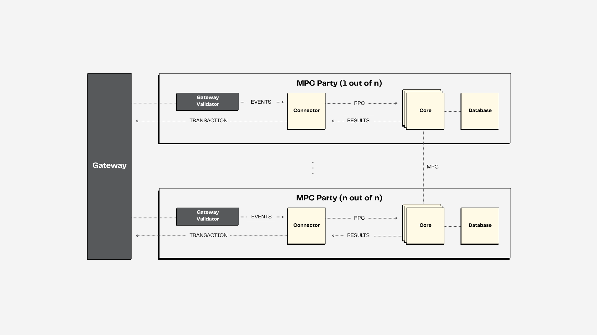

<p align="center">
<!-- product name logo -->
<picture>
  <source media="(prefers-color-scheme: dark)" srcset="KMS-dark.png">
  <source media="(prefers-color-scheme: light)" srcset="KMS-light.png">
  
</picture>
</p>


<p align="center">
   <a href="https://zama.ai/community"> 💛 Community support</a> | <a href="https://github.com/zama-ai/awesome-zama"> 📚 FHE resources by Zama</a> | <a href="https://eprint.iacr.org/2023/815"> 📚 Noah's Ark (peer-reviewed academic paper)</a>
</p>

<p align="center">
  <a href="LICENSE"></a>
  <a href="https://github.com/zama-ai/bounty-program"></a>
  <a href="https://github.com/zama-ai/kms-core/pkgs/container/kms-service"></a>
  <!-- TODO: add release badge once we made a public release -->
</p>

## About

### What is the KMS

The Zama KMS is a fully decentralized key management solution for TFHE, based on a maliciously secure and robust [MPC protocol](https://eprint.iacr.org/2023/815) based on secret sharing,
primarily for threshold key generation and threshold decryption.
We also made the [full specification](https://github.com/zama-ai/threshold-fhe/blob/main/docs/CryptographicDocumentation.pdf)
available to the public.

The system consists of a core cryptography layer that implements cryptographic primitives and MPC protocols and a service layer that packs everything up and offers an interface for interacting with the components.

Interaction with the KMS can either happen via a gRPC interface, or in its deployed form via the [fhevm](https://github.com/zama-ai/fhevm).

### Main features

- Threshold key generation for keys that are compatible with [TFHE-rs](https://github.com/zama-ai/tfhe-rs).
- Threshold decryption of TFHE-rs ciphertexts.
- Resharing of secret FHE key shares.
- Distributed setup for CRS (common reference string) for use in ZK proofs.

### Using the KMS

The following describes how the KMS is used in conjunction with fhevm Gateway, including the external components needed.
While the KMS can be used with multiple L1 EVM host chains, for simplicity, we will in the following document assume there is only a single L1 host chain.

At the highest level, the system consists of multiple subsystems: a *host chain*, an *fhevm Gateway* and a *KMS*.
The KMS is in turn composed of the following components, which we illustrate in the pictures below.



We observe that while the standard deployment of the KMS system is in a threshold setting. It can also be deployed in a centralized manner, where it will consist of a single logical Connector, Core and Keychain DA.


## Installation

### Prerequisites

The project requires [Docker](https://docs.docker.com/engine/install/) to be installed and running, along with [Rust](https://www.rust-lang.org/tools/install) with version >= 1.86, the [protobuf compiler, `protoc`](https://protobuf.dev/installation/), [pkgconfig](https://github.com/pkgconf/pkgconf), and [openssl](https://openssl-library.org/).
Ensure that these are installed on your system.

### Building and testing

For local development, the project can be build with:
```bash
cargo build
```

Typical testing can be done using
```bash
cargo test -F testing
```

Some integration tests may require the use of additional tools. In particular some tests require Redis to be running on the local system.
To avoid them and only run unit tests, run the following command instead:
```bash
cargo test -F testing --lib
```

To run the full test-suite (which may take several hours) run the tests with the `slow_tests` feature:
```bash
cargo test -F slow_tests
```

### Running the KMS locally

> [!Warning]
> Local deployment should not be used in a production environment!

The detailed documentation can be found in the [core-client documentation](./docs/guides/core_client.md).
We give an overview below.

To run the KMS locally, for development and testing purposes, run

```bash
docker compose -vvv -f docker-compose-core-base.yml -f docker-compose-core-threshold.yml build
docker compose -vvv -f docker-compose-core-base.yml -f docker-compose-core-threshold.yml up
```

This will start 4 KMS servers that interact with each other
to perform threshold operations.

It is possible to run the centralized version by replacing `docker-compose-core-threshold.yml` with `docker-compose-core-centralized.yml`.

Then navigate to the `core-client` directory.
This is the client that interacts with the KMS service to perform various key management tasks. For example to securely generate a CRS for the zero knowledge proofs the command would be:

```bash
cargo run -- -f config/client_local_threshold.toml crs-gen
```

For other available commands, use the following help command or have a look at the [core-client documentation](./docs/guides/core_client.md)

```bash
cargo run -- --help
```


### Running the KMS as a service

Docker images that are ready for use can be found [here](https://github.com/zama-ai/kms-core/packages).
But to deploy the KMS securely, we recommend the documentation on [on-prem deployment](docs/guides/on_prem_installation.md).


### More information
For more high-level information about using and deploying the code, check out [this](./docs/README.md) section.


## External Resources

### Theoretical Background
- Blog post on our [threshold key management system](https://www.zama.ai/post/introducing-zama-threshold-key-management-system-tkms)
- The [Noah's ark](https://eprint.iacr.org/2023/815) paper contains the technical details of some of our protocols
- An [initial, preliminary version of our proposed NIST submission](docs/CryptographicDocumentation.pdf), which contains the detailed specification of all contained protocols

### fhevm Application Whitepaper
- [fhevm Whitepaper](https://github.com/zama-ai/fhevm/blob/main/fhevm-whitepaper.pdf)

### Docker images and high level usage
- [Docker images](https://github.com/zama-ai/kms-core/pkgs/container/kms-service)
- [fhevm Integration](https://github.com/zama-ai/fhevm)

## Working with the KMS

### Disclaimers

#### Parameters
The default parameters for the Zama KMS are chosen to ensure a failure probability of 2^-128 and symmetric equivalent security of 128 bits.

#### Side-channel attacks

Mitigation for side-channel attacks has not been implemented directly in the Zama KMS. The smart contract of the blockchain from which calls originate is responsible to ensure the validity of calls. In particular that new ciphertexts are correctly constructed (through a proof-of-knowledge).

### Citations
To cite KMS in academic papers, please use the following entry:
```
@Misc{zama-kms,
  title={{Zama KMS: A Pure Rust Implementation of a Threshold Key Management System for TFHE}},
  author={Zama},
  year={2025},
  note={\url{https://github.com/zama-ai/kms-core}},
}
```

### License
This software is distributed under the **BSD-3-Clause-Clear** license. Read [this](LICENSE.txt) for more details.

#### FAQ
**Is Zama’s technology free to use?**
>Zama’s libraries are free to use under the BSD 3-Clause Clear license only for development, research, prototyping, and experimentation purposes. However, for any commercial use of Zama's open source code, companies must purchase Zama’s commercial patent license.
>
>Everything we do is open source and we are very transparent on what it means for our users, you can read more about how we monetize our open source products at Zama in [this blog post](https://www.zama.ai/post/open-source).

**What do I need to do if I want to use Zama’s technology for commercial purposes?**
>To commercially use Zama’s technology you need to be granted Zama’s patent license. Please contact us hello@zama.ai for more information.

**Do you file IP on your technology?**
>Yes, all Zama’s technologies are patented.

**Can you customize a solution for my specific use case?**
>We are open to collaborating and advancing the FHE space with our partners. If you have specific needs, please email us at hello@zama.ai.


## Support

<a target="_blank" href="https://community.zama.ai">
<picture>
  <source media="(prefers-color-scheme: dark)" srcset="https://github.com/zama-ai/tfhe-rs/assets/157474013/08656d0a-3f44-4126-b8b6-8c601dff5380">
  <source media="(prefers-color-scheme: light)" srcset="https://github.com/zama-ai/tfhe-rs/assets/157474013/1c9c9308-50ac-4aab-a4b9-469bb8c536a4">
  
</picture>
</a>

🌟 If you find this project helpful or interesting, please consider giving it a star on GitHub! Your support helps to grow the community and motivates further development.
