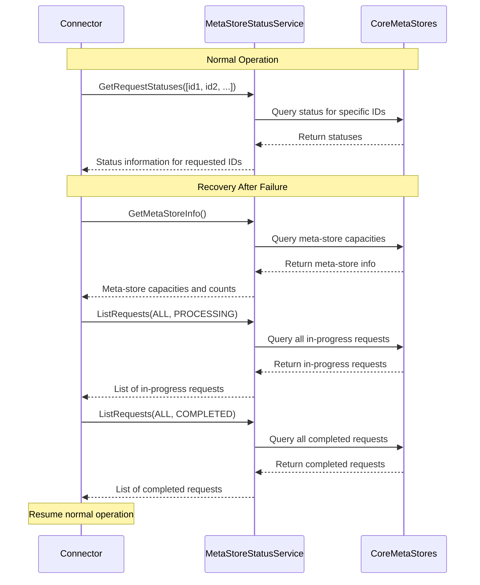

# MetaStore Status Service API

This document describes the MetaStoreStatusService gRPC API, which provides a unified interface for querying the status of requests across different meta-stores in the KMS Core system.

## Overview

The MetaStoreStatusService is designed to allow external components (like Connectors) to efficiently query the status of numerous request IDs that have been processed or are being processed by the KMS Core. This is particularly useful for synchronizing state after a Connector failure or for monitoring the status of high-frequency requests.

## API Design

The service provides three main RPCs:

1. **GetRequestStatuses**: Query the status of specific request IDs
2. **ListRequests**: List and filter requests with pagination
3. **GetMetaStoreInfo**: Get information about meta-stores, including capacity

### Meta-Store Types

The API supports querying across different types of meta-stores:

- `KEY_GENERATION`: Key generation requests
- `PUBLIC_DECRYPTION`: Public decryption requests
- `USER_DECRYPTION`: User decryption requests
- `CRS_GENERATION`: CRS generation requests
- `PREPROCESSING`: Preprocessing for threshold operations
- `ALL`: Query across all meta-store types

### Request Processing Status

Requests can have the following statuses:

- `PROCESSING`: The request is still being processed
- `COMPLETED`: The request has completed successfully
- `FAILED`: The request has failed
- `ANY`: Query any status

## API Flow Diagram



## Usage Examples

### Getting Status for Specific Request IDs

```json
// Request
{
  "request_ids": [
    "bc0cbac18cb2b4a03c3fd2ebc0865dca421424a5b1ca9d2a42037a1f90109938",
    "8366a89bc317c29ecacffe1585414f515cc3786fa99f1b6225153947f75a20a1"
  ],
  "meta_store_type": "KEY_GENERATION"
}

// Response
{
  "statuses": [
    {
      "requestId": "bc0cbac18cb2b4a03c3fd2ebc0865dca421424a5b1ca9d2a42037a1f90109938",
      "metaStoreType": "KEY_GENERATION",
      "status": "COMPLETED"
    },
    {
      "requestId": "8366a89bc317c29ecacffe1585414f515cc3786fa99f1b6225153947f75a20a1",
      "metaStoreType": "KEY_GENERATION"
    }
  ]
}
```

**Note**: In protobuf3 JSON serialization, fields with default values are omitted. The `status` field is omitted when the value is `PROCESSING` (the default/zero value), and `metaStoreType` is omitted when the value is `ALL` (the default). Missing status field indicates `PROCESSING` state.

### Listing Requests with Filtering

```json
// Request
{
  "meta_store_type": "KEY_GENERATION",
  "status_filter": "ANY",
  "max_results": 100
}

// Response
{
  "requests": [
    {
      "requestId": "bc0cbac18cb2b4a03c3fd2ebc0865dca421424a5b1ca9d2a42037a1f90109938",
      "metaStoreType": "KEY_GENERATION",
      "status": "COMPLETED"
    },
    {
      "requestId": "8366a89bc317c29ecacffe1585414f515cc3786fa99f1b6225153947f75a20a1",
      "metaStoreType": "KEY_GENERATION"
    }
  ]
}
```

### Getting Meta-Store Information

```json
// Request
{}

// Response
{
  "metaStores": [
    {
      "type": "KEY_GENERATION",
      "capacity": -1,
      "currentCount": 2
    },
    {
      "type": "PUBLIC_DECRYPTION",
      "capacity": 10000
    },
    {
      "type": "USER_DECRYPTION",
      "capacity": 10000
    },
    {
      "type": "CRS_GENERATION",
      "capacity": -1
    },
    {
      "type": "PREPROCESSING",
      "capacity": -1,
      "currentCount": 1
    }
  ]
}
```

**Note**: `capacity: -1` indicates unlimited capacity. The `currentCount` field is only present when there are active requests in the meta-store.

## Implementation Considerations

### Efficiency

- The API is designed to minimize the number of calls needed for both normal operation and recovery scenarios.
- For normal operation, `GetRequestStatuses` allows querying multiple specific request IDs in a single call.
- For recovery, `ListRequests` allows retrieving all requests of a specific status in batches.
- The API uses the meta-store's capacity as a default limit for batch size when not specified.

### Connector Recovery Process

After a failure, a Connector can recover its state by:

1. Calling `GetMetaStoreInfo` to understand the system's configuration and current load.
2. Calling `ListRequests` with `status_filter: PROCESSING` to get all in-progress requests.
3. Calling `ListRequests` with `status_filter: COMPLETED` to get all completed requests.
4. Resuming normal operation using `GetRequestStatuses` for specific request IDs.

This process ensures the Connector has a complete view of the system's state with minimal API calls.

## Future Extensions

Possible future extensions to this API include:

1. Adding timestamp tracking to support time-based filtering
2. Supporting batch operations for specific request types
3. Adding metrics and statistics about request processing
