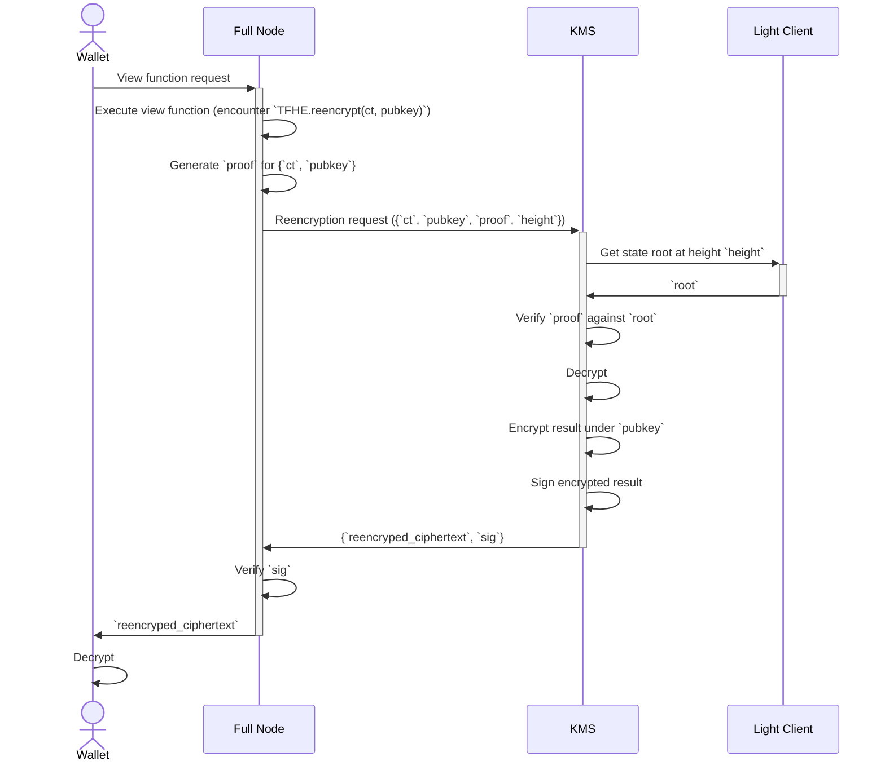

# Key Management System

[](https://github.com/zama-ai/kms/actions)
[](https://github.com/zama-ai/kms/pkgs/container/kms)
[](https://github.com/zama-ai/kms/pkgs/container/kms)
[](LICENSE)


https://github.com/zama-ai/kms/actions/workflows/publish-docker-image.yml

This repository hosts the code for the Zama Key Management System prototypes.

## MVP Specification

The full KMS specification is currently under review. What follows describes a KMS minimal viable product.

### Description
It is assumed that neither decryptions nor reencryptions happen during transactions. Instead, transactions *mark* ciphertexts as decryptable or reencryptable.
Subsequently, full nodes may issue decryption and reencryption requests to the KMS for ciphertexts which have been marked as decryptable or reencryptable. Usually, this happens upon reception of a request from a user or wallet.

### Sequence Diagram (reencryption)


The process for decryptions is analogous.

For the time being, the light client is assumed to provide valid state roots to the KMS service.

In practice, the light client relies on any full node that is live and up to date with the blockchain.
Once the trusted setup is done at genesis, the light client can be trusted to provide valid state roots for any block, as long as the full node it connects to does not engage in byzantine behavior.

## Implementation

The KMS is implemented as a gRPC service using the [tonic](https://github.com/hyperium/tonic) crate.
Communication between full nodes and the KMS service is defined by [protobuf](/proto/kms.proto) messages.
The rest of the communication is defined by existing standards and uses JSON-RPC.
For the light client, we currently use CometBFT's [light](https://pkg.go.dev/github.com/cometbft/cometbft/light) package, which provides a service that connects to any CometBFT full node to serve trusted state roots on-demand.
The light client package handles the logic of sequentially verifying block headers.

Optionally, the gRPC service can be run in an Amazon Nitro enclave and store sensitive key material on S3 encrypted.

## Next steps
- [ ] Full Node ->> KMS Reencryption request should contain user signature on `pubkey` and an `ACL` object.
- [ ] KMS should verify the user signature on `pubkey` against the values of permissible decryptors in `ACL`.

## KMS Core gRPC service specifications

Interactions with KMS core happens through a gRPC service.
In the following we document all the exposed endpoints, detailing for each endpoint the expected input and the expected output of the RPC.

### gRPC data types

<details>
    <summary>RequestId</summary>

#### Definition
```proto
message RequestId { string request_id = 1;}
```

#### Description
This is used as a unique identifier to each request.

`request_id` must be a 20 bytes hex string.


If a request contains a malformed `request_id`, the response will be an error with `tonic::Code::InvalidArgument`.

</details>

<details>
    <summary>FheType</summary>

#### Definition
```proto
enum FheType {
  Ebool = 0;
  Euint4 = 1;
  Euint8 = 2;
  Euint16 = 3;
  Euint32 = 4;
  Euint64 = 5;
  Euint128 = 6;
  Euint160 = 7;
  Euint256 = 8;
  Euint512 = 9;
  Euint1024 = 10;
  Euint2048 = 11;
}
```

#### Description
This enum is used as metadata that accompanies a ciphertext to specify its underlying type.
</details>

<details>
    <summary>FheParameter</summary>

#### Definition
```proto
enum FheParameter {
  default = 0;
  test = 1;
}
```

#### Description
This enum is used to specify the TFHE parameters to use.

__NOTE__: The `test` variant refers to __insecure__ parameters and should **never** be used in production.

</details>

<details>
    <summary>Eip712DomainMsg</summary>

#### Definition
```proto
message Eip712DomainMsg {
  string name = 1;
  string version = 2;
  bytes chain_id = 3; // Encoded as a 32 bit big-endian number
  string verifying_contract = 4;
  optional bytes salt = 5;
}
```

#### Description
This is the domain as defined in the [Eip712 standard](https://eips.ethereum.org/EIPS/eip-712#definition-of-domainseparator), which is then hashed into the domain separator.


</details>

<details>
    <summary>SignedPubDataHandle</summary>

#### Definition
```proto
message SignedPubDataHandle {
  string key_handle = 1;
  bytes signature = 2;
  bytes external_signature = 3;
}
```

#### Description
This is the common structure for all public cryptographic material (i.e public TFHE keys and tfhe CRS).

- `key_handle`: a `SHA3-256` hash of the `tfhe::safe_serialization` of the underlying struct truncated to 20 bytes. This handle serves as the `URI` to locate the actual object in the `storage`.
- `signature`: a `bincode::serialize` of `Secp256k1` signature on the `key_handle`. With the `s` value normalized. That is, ensured that the `s` value will always be in the lower part of the space.
- `external_signature`: a `EIP-712` signature on the _solidity-compatible_  `SHA3-256` hash of the `tfhe::safe_serialization` of the underlying struct. Observe the same signing key is used as for the above `signature`.


__NOTE__: `signature` and `external_signature` look quite redundant.
</details>


### Endpoints (including insecure ones)

### Key Generation
<details>
    <summary> KeyGenPreproc </summary>

#### Input

```proto
message KeyGenPreprocRequest {
  FheParameter params = 1;
  RequestId request_id = 2;
}
```

#### Output

```proto
message Empty {}
```

#### Description
This RPC only makes sense in the __threshold__ case.

It triggers the __asynchronous__ correlated randomness generation that is necessary to perform the Distributed Key Generation on the specified `FheParameter`.

This correlated randomness will then be consumed when calling `KeyGen` with the `preproc_id` set to the current `request_id`.

Observe that this **must** be completed once before *each* key generation call.
Completion status can be validated using the `GetPreprocStatus` end-point.
</details>

<details>
    <summary> GetPreprocStatus </summary>

#### Input

```proto
message RequestId { string request_id = 1; }
```

#### Output

```proto
enum KeyGenPreprocStatusEnum {
  Missing = 0;
  InProgress = 1;
  Finished = 2;
  Error = 3;
  WrongRequest = 4;
}
```
#### Description
This RPC allows to check the status of the correlated randomness generation.

Correlated randomness generation is a slow process (several hours), and we thus provide a way to query its status via its unique identifier `request_id`.
This is because, to initiate a Distributed Key Generation, we must provide a `preproc_id` that is the `RequestId` of a `Finished` preprocessing.

The meaning of the enum is as follows:
- `Missing`: There has not been a `KeyGenPreprocRequest` for the provided `request_id`.
- `InProgess`: The core is still generating the correlated randomness for the specified `request_id`.
- `Finished`: The core is done generating the correlated randomness, and we can thus now call `KeyGen` with `preproc_id` set to the current `request_id`.
- `Error`: An irrecoverable internal server error has occurred during the correlated randomness generation.
- `WrongRequest`: __deprecated__ Indicates that the `request_id` is tied to different parameters.


</details>

<details>
    <summary> KeyGen </summary>

#### Input
```proto
message KeyGenRequest {
  FheParameter params = 1;
  RequestId preproc_id = 2;
  RequestId request_id = 3;
  Eip712DomainMsg domain = 4;
}
```

#### Output

```proto
message Empty {}
```

#### Description
This RPC initiates the __asynchronous__ generation of a new TFHE keyset with parameters defined by the provided `params`. The status or result can be retrieved using the `GetKeyGenResult` end-point.

The `preproc_id` must be the `request_id` of a `Finished` `KeyGenPreprocRequest` in the __threshold__ setting. In the __centralized__ setting, this can be ignored.

All the public material produced during this key generation will be EIP712-signed using the core's private key and the provided `domain` as `Eip712Domain`. This EIP712 signature is referred to as the `external_signature`.

</details>

<details>
    <summary> GetKeyGenResult </summary>

#### Input

```proto
message RequestId { string request_id = 1; }
```

#### Output

```proto
message KeyGenResult {
  RequestId request_id = 1;
  map<string, SignedPubDataHandle> key_results = 2;
}
```

#### Description
This RPC allows to retrieve the status or result of the generation of public key material when `request_id` has been used in a`KeyGen` call.

Because this call is dependent on previous call, it may fail with the following `tonic::Code` error codes:
- `NotFound`: There has not been a `KeyGen` call for the provided `request_id`.
- `Unavailable`: The `KeyGen` for the queried `request_id` has started but is not finished yet.
- `Internal`: The `KeyGen` for the queried `request_id` has failed due to an internal and unrecoverable server error.

If the call is successful, the `KeyGenResult` will contain the `request_id` used in the query, as well as the following map:
- Key: `"PublicKey"`, Value: The `SignedPubDataHandle` corresponding to the generated `tfhe::CompactPublicKey`.
- Key: `"ServerKey"`, Value: The `SignedPubDataHandle` corresponding to the generated `tfhe::ServerKey`.
- __If the setting is threshold__ Key: `"SnsKey"`, Value: The `SignedPubDataHandle` corresponding to the generated `SwitchAndSquashKey`.


</details>

<details>
    <summary> InsecureKeyGen </summary>

___NOTE_: This is a temporary workaround and will only be available in testing/debugging setups. **NOT in production**__

#### Input

```proto
message KeyGenRequest {
  FheParameter params = 1;
  RequestId preproc_id = 2;
  RequestId request_id = 3;
  Eip712DomainMsg domain = 4;
}
```

#### Output

```proto
message Empty {}
```

#### Description
This RPC initiates the __asynchronous__ generation of a new TFHE keyset with parameters defined by the provided `params`.

The `preproc_id` can be ignored.

All the public material produced during this key generation will be EIP712-signed using the core's private key and the provided `domain` as `Eip712Domain`. This EIP712 signature is referred to as the `external_signature`.
</details>

<details>
    <summary> GetInsecureKeyGenResult </summary>

```proto
message RequestId { string request_id = 1; }
```

#### Output

```proto
message KeyGenResult {
  RequestId request_id = 1;
  map<string, SignedPubDataHandle> key_results = 2;
}
```

#### Description
This RPC allows to retrieve the public key material if the `request_id` is that of a finished `KeyGen`.

Because this call is dependent on previous call, it may fail with the following `tonic::Code` error codes:
- `NotFound`: There has not been a `KeyGen` call for the provided `request_id`.
- `Unavailable`: The `KeyGen` for the queried `request_id` has started but is not finished yet.
- `Internal`: The `KeyGen` for the queried `request_id` has failed.

If the call is successful, the `KeyGenResult` will contain the `request_id` used in the query, as well as the following map:
- Key: `"PublicKey"`, Value: The `SignedPubDataHandle` corresponding to the generated `tfhe::CompactPublicKey`.
- Key: `"ServerKey"`, Value: The `SignedPubDataHandle` corresponding to the generated `tfhe::ServerKey`.
- __If the setting is threshold__ Key: `"SnsKey"`, Value: The `SignedPubDataHandle` corresponding to the generated `SwitchAndSquashKey`.
</details>

### CRS Generation

<details>
    <summary> CrsGen </summary>

#### Input

```proto
message CrsGenRequest {
  FheParameter params = 1;
  optional uint32 max_num_bits = 2;
  RequestId request_id = 3;
  Eip712DomainMsg domain = 4;
}
```

#### Output

```proto
message Empty {}
```

#### Description
This RPC initiates the __asynchronous__ generation of a new CRS defined by the provided `params` and `max_num_bits`. Here, `max_num_bits` is the maximum number of bits that can be proven in one go (i.e. 64 bits are required to prove a single `FheUint64`).
If no value is given for `max_num_bits`, it defaults to `2048`.

The status or result of this call can be retrieved with the `GetCrsGenResult` end-point.
The CRS produced during the generation will be EIP712-signed using the KMS core's private key and the provided `domain` as `Eip712Domain`. This `EIP712` signature is referred to as the `external_signature`.
</details>

<details>
    <summary> GetCrsGenResult </summary>

#### Input

```proto
message RequestId { string request_id = 1; }
```

#### Output

 ```proto
 message CrsGenResult {
  RequestId request_id = 1;
  SignedPubDataHandle crs_results = 2;
}
 ```

#### Description
This RPC allows to retrieve the CRS if the `request_id` is that of a successfully completed `CrsGen` call.

Because this call is dependent on previous call, it may fail with the following `tonic::Code` error codes:
- `NotFound`: There has not been a `CrsGen` call for the provided `request_id`.
- `Unavailable`: The `CrsGen` for the queried `request_id` has started but is not finished yet.
- `Internal`: The `CrsGen` for the queried `request_id` has failed.

If the call is successful, the `CrsGenResult` will contain the `request_id` used in the query, as well as a `SignedPubDataHandle` that corresponds to the generated `tfhe_zk_pok::proofs::pke::PublicParams<tfhe_zk_pok::curve_api::Bls12_446>`.

</details>

### Ciphertext ZKPoPK verification

<details>
    <summary> VerifyProvenCt </summary>

#### Input

```proto
message VerifyProvenCtRequest {
  RequestId crs_handle = 1;
  RequestId key_handle = 2;
  string contract_address = 3;
  string client_address = 4;
  bytes ct_bytes = 5;
  string acl_address = 6;
  Eip712DomainMsg domain = 7;
  RequestId request_id = 8;
}
```

#### Output

```proto
message Empty {}
```

#### Description
This RPC initiates the __asynchronous__ ZKPoPK verification of a purported _proven_ ciphertext.
The status and result of the call can be retrieved with the `GetVerifyProvenCtResult` end-point.

It expects:
- `crs_handle`: the `RequestId` that correspond to the CRS used for creating the proof.
- `key_handle`: the `RequestId` that correspond to the TFHE key set used for encrypting the ciphertext.
- `contract_address`: EIP-55 encoded address (including `0x`prefix) of the dapp the input is meant for.
- `client_address`: EIP-55 encoded address (including `0x`prefix) of the client providing the input.
- `ct_bytes`: result of the `tfhe::safe_serialize` of the `ProvenCompactCiphertextList` we want to check the proof of.
- `acl_address`: EIP-55 encoded address (including `0x`prefix) of the ACL contract.

The response will be EIP712-signed using the KMS core's private key and the provided `domain` as `Eip712Domain`. This `EIP712` signature is referred to as the `external_signature`.
</details>

<details>
    <summary> GetVerifyProvenCtResult </summary>

#### Input

```proto
message RequestId { string request_id = 1; }
```

#### Output

 ```proto
message VerifyProvenCtResponse {
  VerifyProvenCtResponsePayload payload = 1;
  bytes signature = 2;
}

message VerifyProvenCtResponsePayload {
  RequestId request_id = 1;
  string contract_address = 2;
  string client_address = 3;
  bytes ct_digest = 4;
  bytes external_signature = 5;
}
 ```

#### Description
This RPC allows to retrieve the necessary information to attest that the input was verified by the KMS core if the `request_id` is that of a finished call to the `VerifyProvenCt` end-point.


The `signature` is a `secp256k1` signature on the `bincode::serialize` of the `payload` using the core's private key.

##### The `payload` is composed of:

The `request_id`, `contract_address` and `client_address` are the one provided in the corresponding `VerifyProvenCt` call.

The `ct_digest` is a `keccak256` digest of the `ct_bytes` provided in the corresponding `VerifyProvenCt` call.

The `external_signature` is an EIP712 signature on the _solidity-compatible_ structure:

```rust
struct CiphertextVerificationForKMS {
        address aclAddress;
        bytes32 hashOfCiphertext;
        address userAddress;
        address contractAddress;
    }
```
where:
- `acl_address` is the one provided in the request,
- `HashOfCiphertext` is the `keccak256` digest of the provided `ct_bytes`,
- `userAddress` is the `client_address` provided in the request
- `contractAddress` is the `contract_address` provided in the request
</details>

### Decryption

<details>
    <summary> Decrypt </summary>

#### Input


```proto
message DecryptionRequest {
  uint32 version = 1;
  repeated TypedCiphertext ciphertexts = 2;
  RequestId key_id = 3;
  Eip712DomainMsg domain = 4;
  optional string acl_address = 5;
  RequestId request_id = 6;
}


message TypedCiphertext {
  bytes ciphertext = 1;
  FheType fhe_type = 2;
  optional bytes external_handle = 3;
}

```

#### Output

```proto
message Empty {}
```

#### Description
This RPC initiates the __asynchronous__ decryption of the provided `ciphertexts`.
The status or result can be retrieved with a call to the `GetDecryptResult` end-point.

It expects:
- `version`: __deprecated__ the version number of the request format.
- `ciphertexts`: an array of the `TypedCiphertext`s (described below) to decrypt.
- `key_id`: the `RequestId` that correspond to the TFHE key the ciphertexts are encrypted under.
- `acl_address`: EIP-55 encoded address (including `0x`prefix) of the ACL contract.

Each ciphertext to be decrypted comes accompanied by some metadata in the `TypedCiphertext` structure:
- `ciphertext` is the `tfhe::safe_serialize` ciphertext. We support both safe serialized `tfhe::CompressedCiphertextList` or `FheUint` types.
- `fhe_type` is the type of the ciphertext (e.g. `FheUint8`)
- `external_handle`: The hex encoded handle identifying the ciphertext on the _main_ (fhevm or coprocessor) chain.

The response will be EIP712-signed using the KMS core's private key and the provided `domain` as `Eip712Domain`. The `EIP712` signature is referred to as the `external_signature`.
</details>

<details>
    <summary> GetDecryptResult </summary>

#### Input

```proto
message RequestId { string request_id = 1; }
```

#### Output

```proto
message DecryptionResponse {
  bytes signature = 1;
  DecryptionResponsePayload payload = 2;
}

message DecryptionResponsePayload {
  uint32 version = 1;
  bytes verification_key = 2;
  bytes digest = 3;
  repeated bytes plaintexts = 4;
  optional bytes external_signature = 5;
}

```

#### Description
This RPC allows to retrieve the plaintexts if the `request_id` is that of a finished `Decrypt`.

The `signature` is a `secp256k1` signature on the `bincode::serialize` of the `payload` using the core's private key.

##### The `payload` is composed of:
- `version`: __deprecated__ the version number of the request format.
- `verification_key`: the `bincode::serialize` `ECDSA/secp256k1` verification key of the core.
- `digest`: The `SHA3-256` digest of the corresponding `bincode::serialize` `Decrypt` request.
- `plaintexts`: An array of `bincode::serialize` `Plaintext` that are the requested decryptions.
- `external_signature`: The `EIP-712` signature on the `DecryptionResult` solidity-compatible structure defined below using the KMS core's private key.


The `Plaintext` struct which is serialized in the `plaintexts` field is:

```rust
pub struct Plaintext {
    pub bytes: Vec<u8>,
    fhe_type: FheType,
}
```
Where `bytes` is the little endian byte vector of the plaintext.

The `DecryptionResult` struct which is signed in the `external_signature` is:

```rust
struct DecryptionResult {
        address aclAddress;
        uint256[] handlesList;
        bytes decryptedResult;
    }
```

Where:
- `aclAddress`: the `alloy_primitives::bits::address::Address`
    from the `acl_address` provided in the corresponding `Decrypt` request.
- `handlesList`: the array of provided `external_handle` of each `TypedCiphertext` converted back to a `U256`.
- `decryptedResult`: the ordered list of plaintexts that are ABI encoded into Solidity Bytes.
</details>


### Reencryption

<details>
    <summary> Reencrypt </summary>

#### Input

```proto
message ReencryptionRequest {
  bytes signature = 1;
  ReencryptionRequestPayload payload = 2;
  Eip712DomainMsg domain = 3;
  RequestId request_id = 4;
}


message ReencryptionRequestPayload {
  uint32 version = 1;
  string client_address = 2;
  bytes enc_key = 3;
  FheType fhe_type = 4;
  RequestId key_id = 5;
  optional bytes ciphertext = 6;
  bytes ciphertext_digest = 7;
}
```

#### Output

```proto
message Empty {}
```

#### Description

This RPC initiates the __asynchronous__ reencryption of the provided `ciphertext`.
Meaning that a specified ciphertext will get _privately_ decrypted and encrypted under a specified non-homomorphic public key.
The process ensures that no-one (even the MPC parties) learn the decrypted value unless they know the private decryption key for the non-homomorphic public key.

It expects:
- `signature`: a hex encoded EIP712 signature on the `enc_key` provided in the `payload`.
- `payload`: the `ReencryptionRequestPayload` described below.

The `ReencryptionRequestPayload` contains all the information necessary to perform the reencryption:
- `version`: the version number of the request format. __NOTE: what is that exactly?__
- `client_address`: An EIP-55 encoded address (including the `0x` prefix) of the end-user who is supposed to learn the reencrypted response.
- `enc_key`: The `bincode::serialize` of `PublicEncKey`, which is a wrapper around a `crypto_box::PublicKey` to be used for encrypting the result.
- `fhe_type`: The type of the ciphertext to reencrypt
- `key_id`: The `RequestId` of the TFHE key the ciphertext is encrypted under.
- `ciphertext`: The `tfhe::safe_serialize` ciphertext. We support both safe serialized `tfhe::CompressedCiphertextList` or `FheUint` types.
- `ciphertext_digest`: The `SHA3-256` digest of the ciphertext above.


The response will be EIP712-signed using the KMS core's private key and the provided `domain` as `Eip712Domain`. The `EIP712` signature is referred to as the `external_signature`.
</details>

<details>
    <summary> GetReencryptResult </summary>

#### Input

```proto
message RequestId { string request_id = 1; }
```

#### Output
```proto
message ReencryptionResponse {
  bytes signature = 1;
  ReencryptionResponsePayload payload = 2;
}

message ReencryptionResponsePayload {
  uint32 version = 1;
  bytes verification_key = 2;
  bytes digest = 3;
  FheType fhe_type = 4;
  bytes signcrypted_ciphertext = 5;
  uint32 party_id = 6;
  uint32 degree = 7;
}
```

#### Description
This RPC allows to retrieve the reencrypted plaintext if the `request_id` is that of a finished `Reencrypt`.

The signature is a `secp256k1` signature on the `bincode::serialize` of the `payload` using the core's private key.

##### The `payload` is composed of:
- `version`: __deprecated__ the version number of the request format.
- `verification_key`: the `bincode::serialize` `ECDSA/secp256k1` verification key of the core.
- `digest`: The concatenation of two digests `(eip712_signing_hash(pk, domain) || ciphertext digest)`
- `fhe_type`: The type of the reencrypted plaintext.
- `signcrypted_ciphertext`: A bincode encoding of the signcryption. In the __threshold__ setting, this is a signcryption of a share, in the __centralized__ setting, this is a signcryption of the plaintext directly.
- `party_id`: The MPC ID of the KMS core party doing the reencryption. Necessary for doing the share reconstruction.
- `degree`: The degree of the sharing scheme used. Necessary for doing the share reconstruction.
</details>


## Contribution

See [CONTRIBUTING.md](CONTRIBUTING.md).
