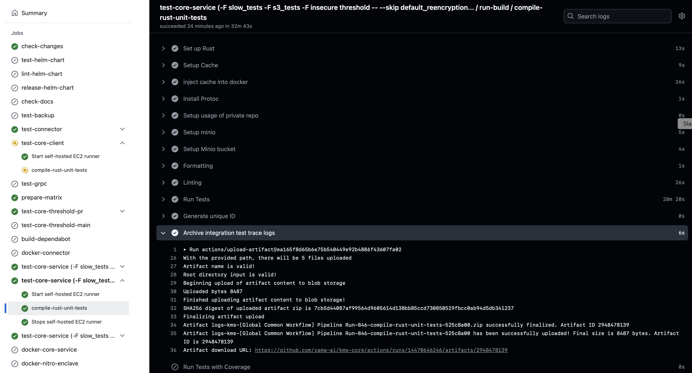
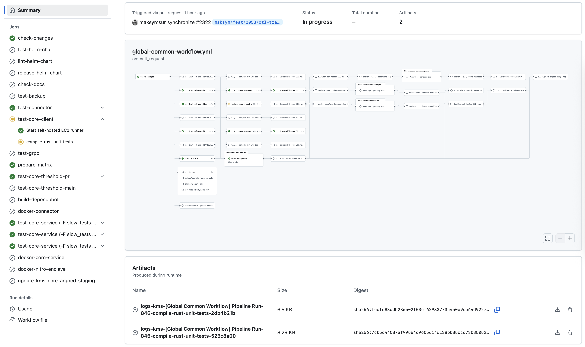
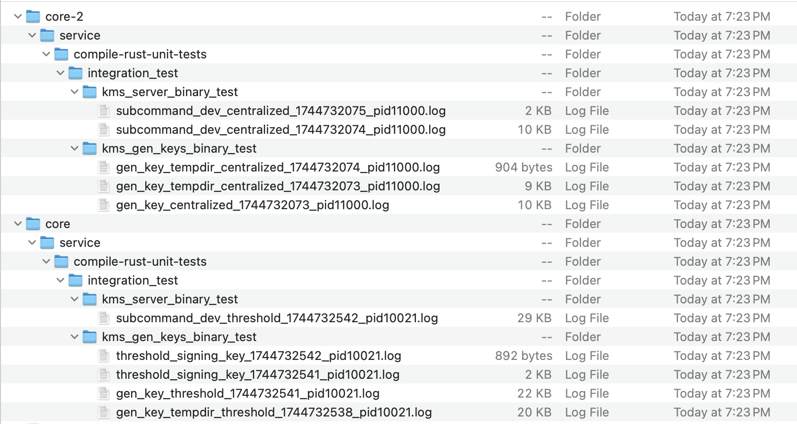

# Test Utilities

This package provides procedural macros to enhance and simplify testing in the KMS Core project.

## Features

### `integration_test` Attribute Macro

This attribute macro ensures proper setup for integration tests by:

- Setting `RUN_MODE=integration` environment variable
- Disabling OpenTelemetry and associated port initialization
- Maintaining thread-safe initialization via the `Once` pattern

**Example Usage:**

```rust
#[test]
#[integration_test]
fn my_integration_test() {
    // Test code that needs the integration environment setup
}
```

### `persistent_traces` Attribute Macro

This attribute macro enables persistent trace logging for tests by:

- Configuring file-based trace logging
- Making logs available for CI artifact collection without changing test behavior
- Setting context-specific environment variables for trace organization:
  - `TEST_MODULE_PATH`: Module path with proper directory separators
  - `TEST_FUNCTION_NAME`: Name of the test function
  - `TEST_PROCESS_ID`: Unique process ID for CI artifact differentiation
  - `TEST_JOB_NAME`: GitHub job name (when available in CI environment)
  - `TRACE_PERSISTENCE`: Enabled flag

**Example Usage:**

```rust
#[test]
#[persistent_traces]
fn my_test_with_logging() {
    // Test code that benefits from persistent trace logging
}
```

See example where several tests were annotated and respective artifacts were created:

1. GitHub Action that persists traces emitted by selected tests into artifacts


2. Global view on a Workflow with generated Artifacts for retrieval


3. Internal structure of Artifacts (made to resemble actual hierarchy up to annotated test)


## Implementation Notes

- Both macros use Rust's procedural macro system to wrap test functions with necessary setup code
- The initialization happens only once per test function via Rust's `std::sync::Once`
- These macros can be combined with other test attributes as needed
