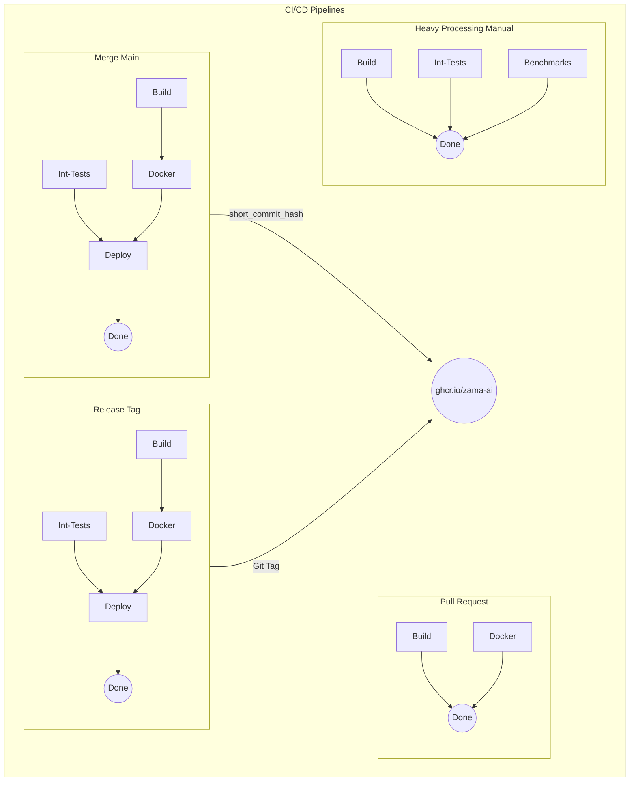
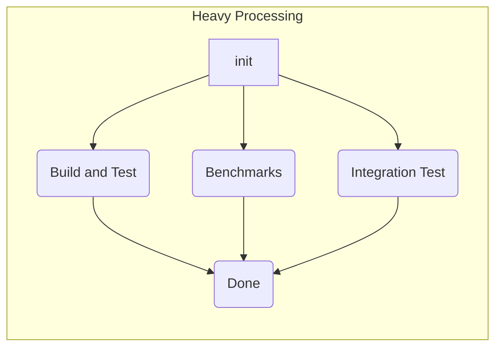
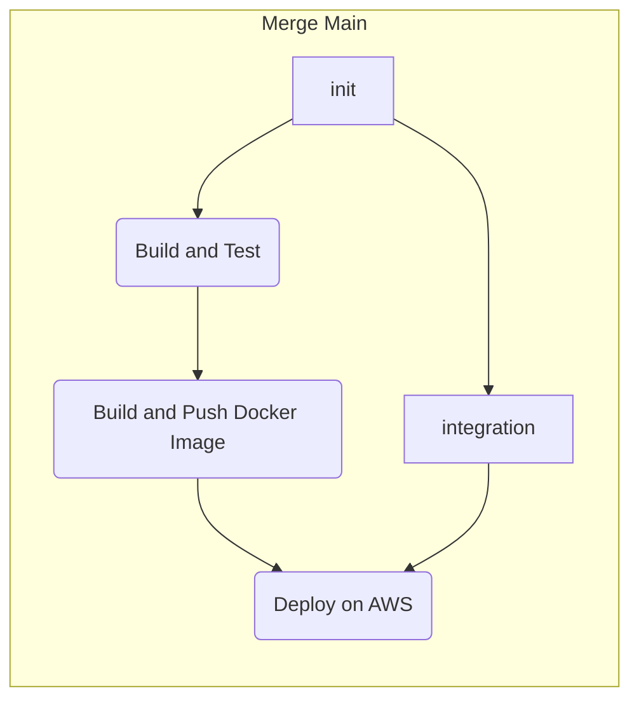
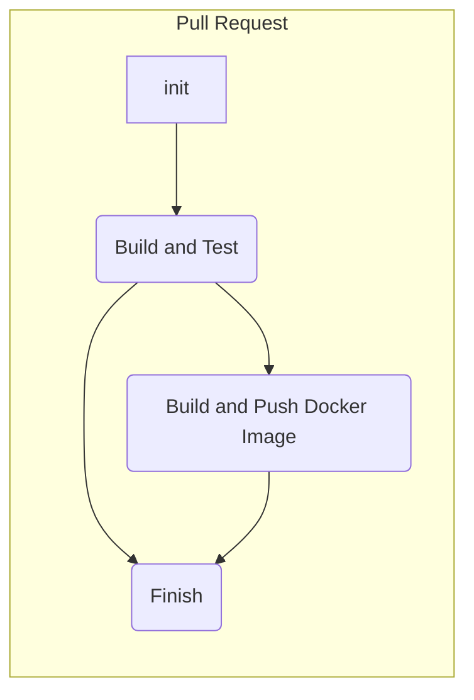
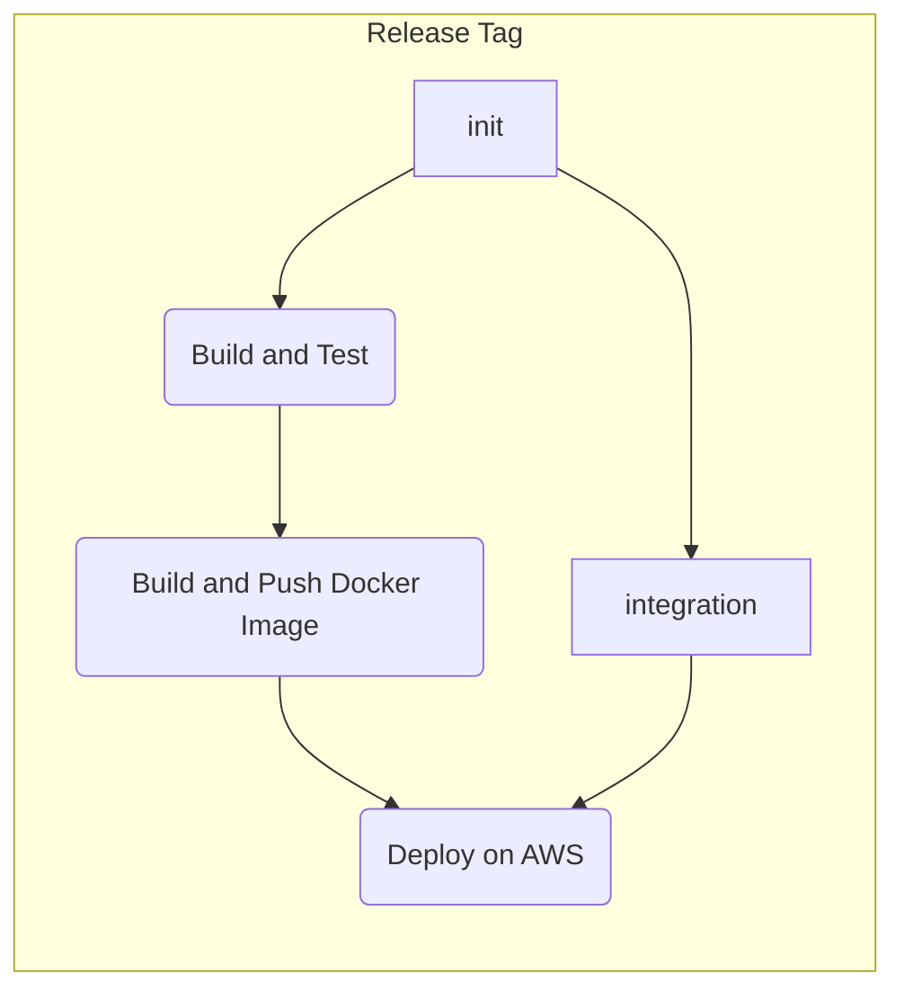

# CI/CD Pipelines for GitHub Actions

This document describes the four CI/CD pipelines that are defined in the `.github/workflows` folder of this repository. These pipelines are triggered by different events and perform different tasks, such as building, testing, dockerizing, and deploying the application.

## General Description

There are 3 automated pipelines which are executed automatically on different events:

- **Merge Main**: When a merge or commit to `main` branch occurs.
- **Pull Request**: When a commit to a pull request branch occurs.
- **Release Tag**: When a Release Tag is publish in Github according to certain semantic versioning pattern.

On the other hand there is only 1 manual pipeline for running long tests and benchmarks which might take more than 1 hour, called **Heavy Processing**.

## Pipelines Details

When an automated pipeline occurs, in general there are mandatory steps that needs to be done. The most fundamental one is `common-build.yml`, which includes the basics steps of checking out the project, compiling and running unit testing. After build also `common-docker.yml` is executed for every pipeline in order to be sure Docker image can be built and push into the registry. In this case to `ghcr.io/zama-ai` registry.

In the case of **Merge Main** and **Pelease Tag**, there are other 2 important steps happening:

- `common-integration-test.yml`: Run integration tests (a.k.a. `cargo test --tests`)
- `common-deploy.yml`: Run terraform deployment according to the environment and deploy in AWS.

## Versioning Docker Images

Docker images will be tagged and pushed with a specific version according where the building is happening.

- **Short commit hash**: This will be in case we are in **Pull Request** or **Merge main** pipeline
- **Git Tag**: In case **Release Tag**.

This kind of versioning will provide traceability from the docker image running up to the exact moment in the Git history.

At the same time, this image version, will be propagated and injected to Deploy step, when it is enable, for example in **Merge main** or **Release Tag** pipeline, allowing the deployment descriptor to point to the correct image version for the specific deploy.

## Deployment environment

In the case of the deployment we are also detecting the moment or event that the deploy has been triggered running `terraform` commands against the desired configuration. In the case it is run on **Merge main** pipeline, `operations/terraform/environments/dev` configuration will be applied and if it is run on **Release Tag**, `operations/terraform/environments/prod` will be run.

## Heavy Processing (Integration Tests and Benchmarks)

- **File**: [File](../.github/workflows/heavy-processing-manual.yml)
- **Type**: Manual

### Description

- **build**: This job uses the `common-build.yml` workflow to build the application and run unit tests.
- **integration-test**: This job uses the `common-integration-test.yml` workflow to run integration tests against the application. It requires the `SLAB_ACTION_TOKEN`, `SLAB_BASE_URL`, and `JOB_SECRET` secrets to access the external services. This secrets are provided in the context of the repository.
- **benchmarks**: This job uses the `common-benchmarks.yml` workflow to run performance benchmarks on the application.
- **done**: This job runs on `ubuntu-latest` and simply prints a success message. It depends on the completion of the previous three jobs and it is a join **NOOP** task.

## Merge Main

- **File**: [File](../.github/workflows/main.yml)
- **Type**: On Merge to `main` branch or Push to `main` branch

### Description

- **build**: This job is the same as the one in the Pipeline Run pipeline.
- **docker**: This job uses the `common-docker.yml` workflow to build a docker image of the application and push it to the registry. It also outputs the `image_name` for the next job.
- **deploy**: This job uses the `common-deploy.yml` workflow to deploy the docker image to the target environment. It requires the `image_name` input from the previous job, as well as the `AWS_IAM_ID`, and `AWS_IAM_KEY` secrets to access the AWS resources. All secrets are provided in the context of the repository.
- **integration-test**: This job is the same as the one in the Pipeline Run pipeline, except that it depends on the `docker` and `deploy` jobs instead of the `build` job.

## Pull Request

- **File**: [File](../.github/workflows/pr.yml)
- **Type**: On each push to any PR based on `main` branch

- **build**: This job is the same as the one in the Pipeline Run pipeline.
- **docker**: This job is the same as the one in the Merge Main pipeline.

## Release Tag

- **File**: [File](../.github/workflows/release.yml)
- **Type**: On each generate release Tag on Github. This will require the semantic version of the tag starts with **"v"** letter. For example: *v1.0.0*, *v0.1.1*, etc.

This pipeline is triggered by pushing a tag that starts with `v`. It consists of four jobs:

- **build**: This job is the same as the one in the Pipeline Run pipeline.
- **integration-test**: This job is the same as the one in the Pipeline Run pipeline.
- **docker**: This job is the same as the one in the Merge Main pipeline.
- **deploy**: This job is the same as the one in the Merge Main pipeline, except that it deploys to the production environment.

