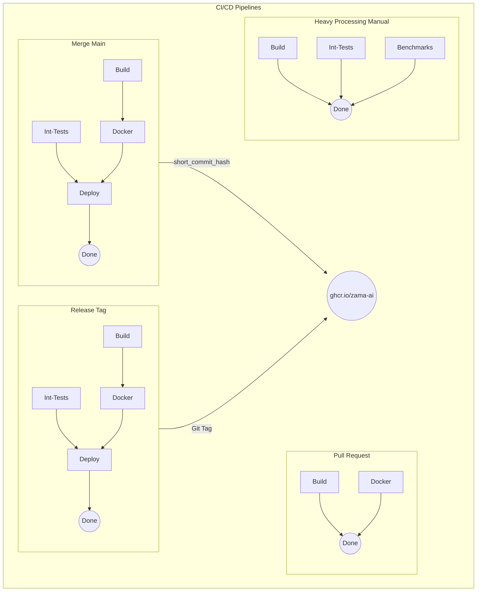
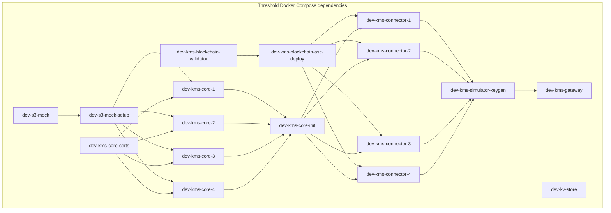

```mermaid
graph
    subgraph P[Pull Request]
        BD[Build] --> D((Done))
        DC[Docker] --> D((Done))
    end
    subgraph M[Merge Main]
        BD1[Build] --> DC1[Docker]
        IN1[Int-Tests] --> DP1[Deploy]
        DC1[Docker] --> DP1[Deploy]
        DP1[Deploy] --> D1((Done))
    end
    subgraph R[Release Tag]
        BD2[Build] --> DC2[Docker]
        IN2[Int-Tests] --> DP2[Deploy]
        DC2[Docker] --> DP2[Deploy]
        DP2[Deploy] --> D2((Done))
    end
    subgraph H[Heavy Processing Manual]
        BD3[Build] --> D3((Done))
        IN3[Int-Tests] --> D3((Done))
        BM3[Benchmarks] --> D3((Done))
    end
    subgraph CICD[CI/CD Pipelines]
        P
        M --> |short_commit_hash| B((ghcr.io/zama-ai))
        R --> |Git Tag| B
        H
    end
```

<!-- TODO: Have this graph be automatically generated from the docker compose. -->

```mermaid
graph
  subgraph Threshold Docker Compose dependencies
    direction LR
    dkbv[dev-kms-blockchain-validator]
    dkbad[dev-kms-blockchain-asc-deploy]
    dks[dev-kv-store]
    dsm[dev-s3-mock]
    dsms[dev-s3-mock-setup]
    dkbv --> dkbad
    dsm --> dsms

    dkcc[dev-kms-core-certs]
    dkc1[dev-kms-core-1]
    dkc2[dev-kms-core-2]
    dkc3[dev-kms-core-3]
    dkc4[dev-kms-core-4]

    dsms --> dkc1
    dsms --> dkc2
    dsms --> dkc3
    dsms --> dkc4

    dkcc --> dkc1
    dkcc --> dkc2
    dkcc --> dkc3
    dkcc --> dkc4

    dkci[dev-kms-core-init]
    dkc1 --> dkci
    dkc2 --> dkci
    dkc3 --> dkci
    dkc4 --> dkci

    dkcon1[dev-kms-connector-1]
    dkcon2[dev-kms-connector-2]
    dkcon3[dev-kms-connector-3]
    dkcon4[dev-kms-connector-4]

    dkbad --> dkcon1
    dkbad --> dkcon2
    dkbad --> dkcon3
    dkbad --> dkcon4

    dkci --> dkcon1
    dkci --> dkcon2
    dkci --> dkcon3
    dkci --> dkcon4

    dksk[dev-kms-simulator-keygen]

    dkcon1 --> dksk
    dkcon2 --> dksk
    dkcon3 --> dksk
    dkcon4 --> dksk

    dkg[dev-kms-gateway]
    dksk --> dkg
  end
```
