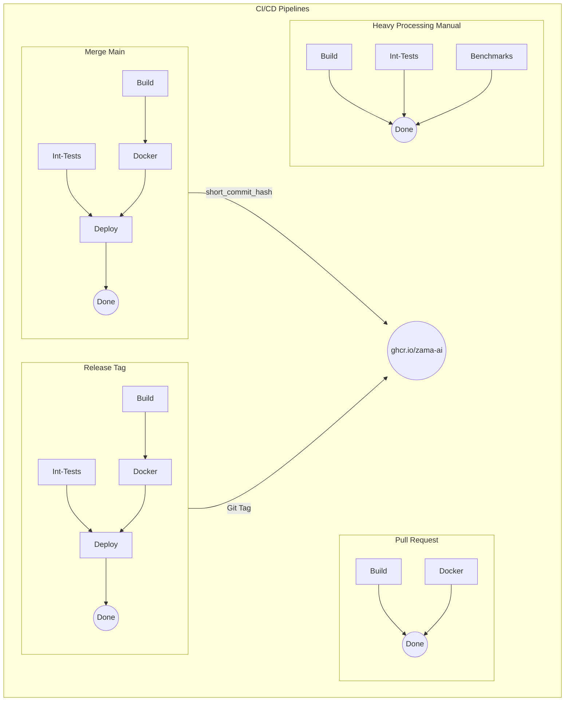
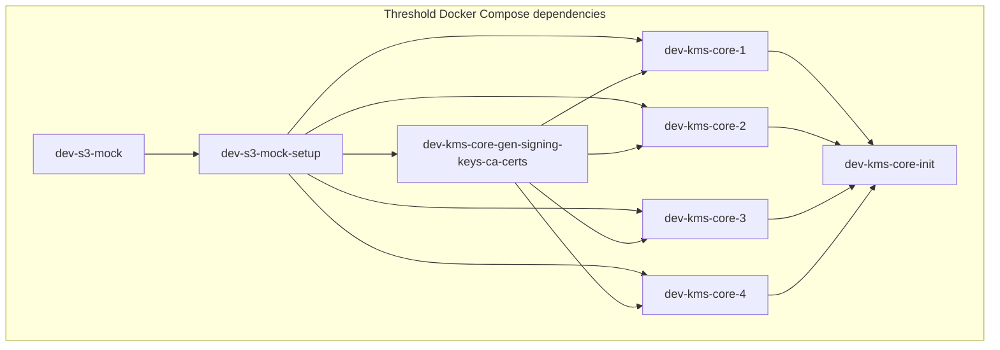

<!-- TODO: Have this graph be automatically generated from the docker compose. -->

The compose files at the repo root are layered: `docker-compose-core-base.yml`
provides the S3 mock, and is combined with either
`docker-compose-core-centralized.yml` (a single `dev-kms-core`),
`docker-compose-core-threshold.yml` (4 parties), or
`docker-compose-core-threshold-6.yml` (6 parties).
`docker-compose-telemetry.yml` adds Prometheus and Jaeger sidecars.

