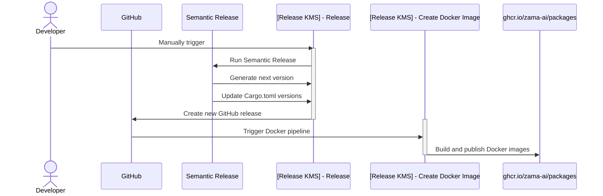

# Release Pipeline

Our release pipeline is designed to automate the process of generating new releases and publishing Docker images for our project.

We have 2 Pipelines for generating a Release:

- **[Release KMS] - Release** (Manually triggered) which you can see [here](../../.github/workflows/release.yml)
- **[Release KMS] - Create Docker Images** (Automatically triggered) which you can see [here](../../.github/workflows/on-release-images.yml)

## 1. [Release KMS] - Release

We use **Semantic Release** to automatically determine the next version of our release based on conventional commits. This ensures that our versioning is consistent and follows semantic versioning principles.

### Steps:
1. **Manual Trigger**: The developer manually triggers the pipeline.
2. **Generate Next Version**: Semantic Release analyzes the commits since the last release to determine the next version.
3. **Update `Cargo.toml`**: The version in the different `Cargo.toml` files of our Rust project is updated to the new version generated in the previous step.
4. **Create GitHub Release**: A new release is created on GitHub with the updated version.

## 2. [Release KMS] - Create Docker Images

We have another pipeline that listens for new releases and handles the building and publishing of Docker images.

### Steps:
1. **Listen for New Releases**: The pipeline is triggered when a new release is created.
2. **Build Docker Images**: The pipeline builds Docker images for the project.
3. **Publish Docker Images**: The built Docker images are published to the Docker registry.

## Sequence Diagram

