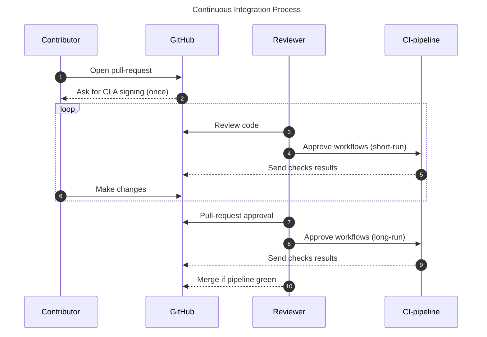

# Contributing

This document provides guidance on how to contribute to **TKMS**.

There are two ways to contribute:

- **Report issues:** Open issues on GitHub to report bugs, suggest improvements, or note typos.
- **Submit codes**: To become an official contributor, you must sign our Contributor License Agreement (CLA). Our CLA-bot will guide you through this process when you open your first pull request.

## 1. Setting up the project

Start by [forking](https://docs.github.com/en/pull-requests/collaborating-with-pull-requests/working-with-forks/fork-a-repo) the **TKMS** repository.


- **Rust version**:  Ensure that you use a Rust version >= 1.86 to compile.
- **Performance**: For optimal performance, it is highly recommended to run **TKMS** code in release mode with cargo's `--release` flag.


To get more details about the library, please refer to the [documentation](https://github.com/zama-ai/kms-core/tree/main/docs).

## 2. Creating a new branch

When creating your branch, make sure to use the following format, based on Semantic Versioning ([semver.org](https://semver.org/)):

```
git checkout -b {feat|fix|docs|chore…}/issue_number/short_description
```

For example:

```
git checkout -b feat/1337/new_feature_X
```

## 3. Before committing

### 3.1 Linting

Each commit to **TKMS** should conform to the standards of the project. In particular, every source code, docker or workflows file should be linted to prevent programmatic and stylistic errors.

- Rust source code linters: `cargo-fmt` and `clippy`

To format the code and check for issues the following commands are used:

```
cargo fmt
cargo clippy --all-targets --all-features -- -D warnings
```

### 3.2 Testing

Your contributions must include comprehensive documentation and tests without breaking existing tests.
In particular if you add any new public functions then you must add positive (sunshine) tests for all of these functions.
If you are editing any business logic or cryptographic methods, negative tests must be supplied as well (i.e. it must be validated that checks fail when expected).

Unit testing suites are heavy and can require a lot of computing power and RAM.
Similarly, for integration tests, which also **requires** a running Redis instance with standard ports.
Whilst tests are run automatically in the continuous integration (CI) pipeline, you can run tests locally.

All tests executed by the CI (including integration tests) can be run with:
```bash
cargo test --F slow_test
```
Observe that this will take several hours.

All "fast" tests (including integration tests) can be run with:
```bash
cargo test
```

The "fast" unit tests (the recommended approach before submitting a PR) can be run with:
```bash
cargo test --lib
```


If your PR only modifies files in a single crate, then running `cargo test --lib` from the root directory of this crate will only execute the tests within this crate, which will be much faster than running _all_ the unit tests in the whole project.



## 4. Committing

**TKMS** follows the conventional commit specification to maintain a consistent commit history, essential for Semantic Versioning ([semver.org](https://semver.org/)).
Commit messages may automatically be checked in CI and will be rejected if they do not comply, so make sure that you follow the commit conventions detailed on [this page]
(https://www.conventionalcommits.org/en/v1.0.0/).

## 5. Policies
Any code changes must adhere to certain policies and stylistic choices. These are specified below.

### Errors
1. Checks for potential errors, e.g. malformed data, should happen as soon as possible and not be deferred down the line.
2. When the error is because of bad input or adversarial behavior no panic should happen. Instead the error should be logged appropriately and with sufficient detail to uniquely figure out where it happened and why.
3. Errors that can only happen because of a bug *should* cause a panic. E.g. and index-out-of-bound exception on a vector that has a known size, or a `None` value in a segment of code that should never be executed if this is the case.
4. Whenever a `panic` happens or an error is `unwrap`ed a comment should explain why this is indeed a bug.
5. In fact, unless the `unwrap()` is in an obvious place in the code and it can be inferred from the context what it wrong, it is preferred to use `expect()` with a detailed error message that explains the details.


## Dependencies
We have certain rules about dependencies and how we manage them, mostly related to security.

1. *Never* update a version of a dependency as part of a regular PR. Such updates must be done in a separate PR.
2. Do not update a dependency unless the update is really needed because of new features, or to fix a bug we have encountered or to fix a known security issue.
3. Do not add new dependencies without previous discussion with the TKMS team.

## 6. Merging

We use a squash-and-merge approach to integrating PRs into the `main` branch. To avoid conflicts make sure to merge the `main` branch into your own at regular intervals.
```bash
git checkout main
git pull
git checkout <your branch>
git merge main
```

## 7. Opening a Pull Request

Once your changes are ready, open a pull request.

For instructions on creating a PR from a fork, refer to GitHub's [official documentation](https://docs.github.com/en/pull-requests/collaborating-with-pull-requests/proposing-changes-to-your-work-with-pull-requests/creating-a-pull-request-from-a-fork).

## 8. Continuous integration (CI)

Before a pull request can be merged, several test suites run automatically. Below is an overview of the CI process:



> [!Note]
>Useful details:
>* Make sure your PR is marked as "Ready for review" when it is ready for review. Until it is ready, keep it marked as "Draft".
>* The CI Pipeline is triggered by humans.
>* The Review team is located in European time zones, therefore the pipeline launch will most likely happen during European office hours.
>* direct changes to CI related files are not allowed for external contributors.
>* direct changes to dependencies are also not allowed, _including_ minor version updates of existing dependencies.

## 9. Data versioning

Data serialized with TKMS must remain backward compatible. This is done using the [tfhe-versionable](https://crates.io/crates/tfhe-versionable) crate.

If you modify a type that derives `Versionize` in a backward-incompatible way, an upgrade implementation must be provided.

For example, these changes are data breaking:
 * Adding a field to a struct.
 * Changing the order of the fields within a struct or the variants within an enum.
 * Renaming a field of a struct or a variant of an enum.
 * Changing the type of field in a struct or a variant in an enum.

On the contrary, these changes are *not* data breaking:
 * Renaming a type (unless it implements the `Named` trait).
 * Adding a variant to the end of an enum.

## Example: adding a field

Suppose you want to add an i32 field to a type named `MyType`. The original type is defined as:
```rust
#[derive(Serialize, Deserialize, Versionize)]
#[versionize(MyTypeVersions)]
struct MyType {
  val: u64,
}
```
And you want to change it to:
```rust
#[derive(Serialize, Deserialize, Versionize)]
#[versionize(MyTypeVersions)]
struct MyType {
  val: u64,
  other_val: i32
}
```

Follow these steps:

 1. Navigate to the definition of the dispatch enum of this type. This is the type inside the `#[versionize(MyTypeVersions)]` macro attribute. In general, this type has the same name as the base type with a `Versions` suffix. You should find something like

```rust
#[derive(VersionsDispatch)]
enum MyTypeVersions {
  V0(MyTypeV0),
  V1(MyType)
}
```

 2. Add a new variant to the enum to preserve the previous version of the type. You can simply copy and paste the previous definition of the type and add a version suffix:

```rust
#[derive(Version)]
struct MyTypeV1 {
  val: u64,
}

#[derive(VersionsDispatch)]
enum MyTypeVersions {
  V0(MyTypeV0),
  V1(MyTypeV1),
  V2(MyType) // Here this points to your modified type
}
```

 3. Implement the `Upgrade` trait to define how we should go from the previous version to the current version:
```rust
impl Upgrade<MyType> for MyTypeV1 {
  type Error = Infallible;

   fn upgrade(self) -> Result<MyType, Self::Error> {
       Ok(MyType {
           val: self.val,
           other_val: 0
        })
   }
}
```

 4. Fix the upgrade target of the previous version. In this example, `impl Upgrade<MyType> for MyTypeV0 {` should simply be changed to `impl Upgrade<MyTypeV1> for MyTypeV0 {`
