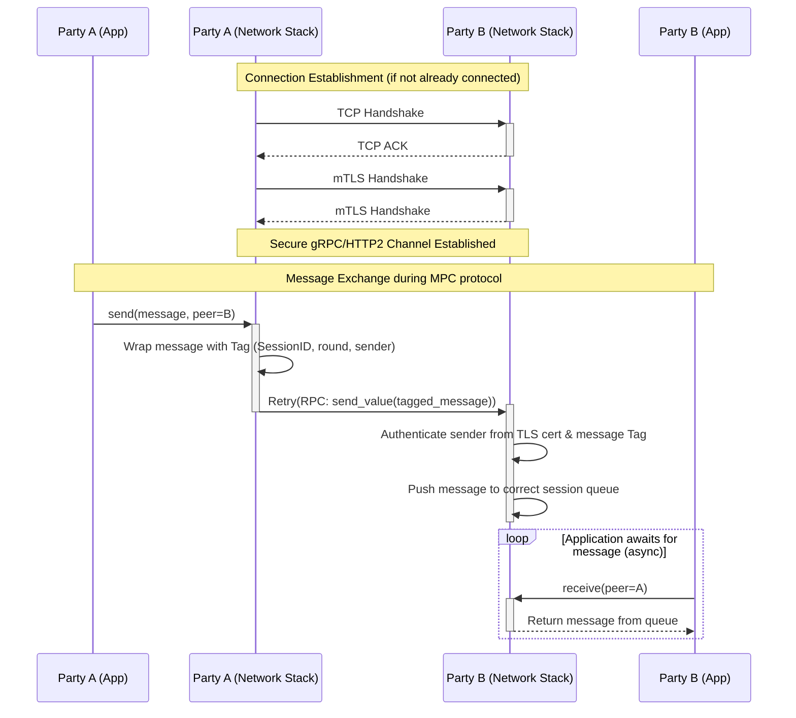

This document outlines the gRPC-based peer-to-peer (P2P) communication protocol used between MPC (Multi-Party Computation) nodes in the KMS. It covers both secure communication using mutual TLS (mTLS) and insecure communication over a trusted network.

### P2P Networking Architecture

*NOTE : The TLS handshake is simplified and could be extended in particular describing the custom checks from the work of Nikita.*

*   **L7 (Application):** The MPC protocol logic, which sends and receives messages required for the MPC protocol.
*   **L6/7 (Presentation/Session):**
    *   **gRPC/HTTP2:** A RPC framework is used for structured communication between nodes, using unary messages.
    *   **mTLS:** Mutual TLS is employed to establish a secure and authenticated channel. Each node presents a certificate to prove its identity, and this identity is verified by its peers.
*   **L4 (Transport):** TCP provides reliable, ordered, and error-checked delivery of a stream of bytes.
*   **L2/3 (Data Link/Network):** It is assumed that nodes operate within a secure, private network (e.g., an AWS VPC with PrivateLink, or a VPN). This layer provides the foundational connectivity but does not, by itself, guarantee the authenticity of the communicating endpoints.

### Communication Flow

The networking service uses a session-based model. For each MPC computation (i.e. each new *decryption*, *preprocessing* or *DKG*), a `NetworkSession` is created with its own unique `SessionID`, which manages the communication rounds and state for that specific computation.

1.  **Connection Establishment:** When a node needs to communicate with a peer, it establishes a gRPC channel. If mTLS is enabled, this involves a (*custom*) TLS handshake where both parties validate each other's certificates.
2.  **Message Sending:**
    *   The application sends a message through its `NetworkSession`.
    *   The session wraps the message with metadata (session ID, sender identity, round number) into a `Tag`.
    *   The message is sent to a dedicated background task for that peer connection, each party has a single such task that is used by all sessions.
    *   The background task uses an exponential backoff retry mechanism to handle transient network errors and sends the message over the gRPC channel.
3.  **Message Receiving:**
    *   The gRPC server on the receiving node listens for incoming `send_value` RPC calls.
    *   Upon receiving a request, it first authenticates the sender if mTLS is enabled.
    *   The message is pushed into a queue specific to that session and sender.
    *   The application logic on the receiving node polls this queue to retrieve the message.

*NOTE : There is some logic in the **Message Receiving** part to handle messages coming for sessions about which the receiver is not yet aware (e.g. if the request to decrypt hasn't reached that party yet). In short, those messages are kept for a short amount of time, and if the party never becomes aware of that session, the messages are discarded.*

### TLS Configuration and Requirements

When operating in a zero-trust environment, mTLS is used to secure P2P communication.

#### Identity and Authentication

Each MPC node is identified by its **Common Name (CN)** within its certificate. This identity is validated against the certificate's **Subject Alternative Name (SAN)** list.

**NOTE** : *This will be changed with support of wildcard certificate, exact requirements are still discussed here. See [here](https://github.com/zama-ai/kms-internal/issues/2709)*

**About the Certificates:**

1.  **Identity:** The `hostname` of a party (e.g., `party1.example.com`) **must** be present as the certificate's `Common Name (CN)`.
2.  **Self-Signed or Private CA:** Certificates are expected to be self-signed, the Subject CN must match the Issuer CN.
3.  **SAN Entry:** The Common Name **must** also be listed as a DNS entry in the Subject Alternative Name (SAN) extension.
4.  **Trust Store:** Each node must be configured with the CA certificates of all peers it communicates with. Certificates are self-signed, each peer's certificate acts as its own CA certificate and is added to the trust stores of other nodes.

During the TLS handshake and **upon receiving any message during the MPC protocol**, the server validates that the identity presented in the peer's certificate (the CN) matches the sender identity claimed in the message payload. This prevents a malicious actor from impersonating another node, even if they manage to establish a TLS session.

#### AWS Nitro Enclave Attestation

**TODO** : *Should be checked and modified by Nikita. Maybe also describe how exactly do we produce and export the certificate (it seems to be using the `SemiAuto` or `FullAuto` conf. but it'd be nice to add some more details).*

For enhanced security in cloud environments, the system supports TLS integrated with AWS Nitro Enclave attestation. In this mode (`SemiAuto` or `FullAuto`), the TLS certificate is extended to include a cryptographically signed attestation document from the enclave. This document proves:
*   The exact code (PCR hashes) running inside the enclave.
*   That the private key used for the TLS session was generated inside and has never left the enclave.

The custom TLS verifier (`AttestedServerVerifier` and `AttestedClientVerifier`) validates the standard certificate chain and additionally checks the attestation document and its PCR values against a list of trusted software releases.

### Non-TLS Configuration (*INSECURE*)

**THIS CONFIGURATION IS INSECURE**

*   **No Authentication at L6/7:** Without TLS, the gRPC server has no cryptographic way to verify the identity of the client. It trusts that any connection to its port is from a legitimate peer, and blindly trust the peer is whom it claims to be in the message's tag.
*   **Risk:** Any attacker can impersonate an MPC node, potentially corrupting or exfiltrating data from the computation. This mode should only be used for testing.