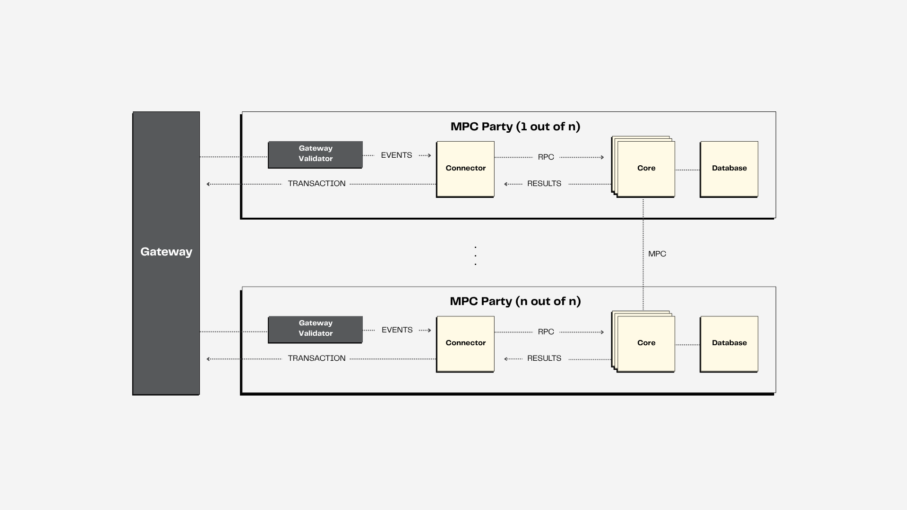

# Introduction

KMS stands for Key Management System. Classically such systems have been used by banks, credit card companies and large firms to keep track and manage all the different cryptographic keys that are in play in their system.
Most existing KMS system use Hardware Security Modules (HSMs) to manage cryptographic keys. These are special pieces of hardware designed to protect the data stored within them. However, they are proprietary, support limited cryptographic ciphers, expensive and can be attacked given enough time, skill and physical access. Hence they mainly protect against hackers, not physical attackers.
The Zama KMS implements a advanced multi-party cryptographic protocols for key management to overcome these limitations. By using multi-party protocols (known as secure Multi-Party Computation or MPC), we are able to facilitate key management without custom and proprietary hardware, in a _threshold_ setting. Meaning that to compromise the Zama KMS, you will not just need to compromise one system; you will need to compromise many. This is because the private keys _never_ exist in plain on any specific device. To learn more about this technology see [the section on threshold cryptography](./concepts.md).
<!--
TODO: Also mention NIST main submission document, once it's public.
-->

Besides providing threshold security, the Zama KMS also allows for public auditability by leveraging a L2 or L3 blockchain to manage operations. Besides bringing auditability, this also allows for fraud proofs to penalize (based on a token-ante) any corrupt party.
For the fhevm Gateway the Zama KMS uses Arbitrum on Conduit and refer the reader to [this repo](https://github.com/zama-ai/gateway-l2) for more details and the actual contracts deployed.

The Zama KMS furthermore allows key management of Fully-Homomorphic Encryption (FHE) keys.
More specifically it allows the following operations with threshold security:
- FHE key generation: Generating new public keys with privately shared key shares for FHE keys.
- Key switching key generation: Generation of special public keys that can switch a ciphertext encrypted under key A to a ciphertext encrypted under key B.
- Generation of powers-of-tau common reference strings: Generation of correlated random material in a secure manner that is required to construct certain zero-knowledge proofs of knowledge. In particular for proving knowledge of plaintext encrypted under FHE keys.
- Public Decryption
- User Decryption (plaintext can only be read by the intended recipient)

## Architecture
In the grand scheme of things the Zama KMS fits into the Zama fhevm system, which is designed to provide a fully decentralized solution for confidential smart contracts based on fully homomorphic encryption, running on EVM blockchains.

This system is facilitated through the following main components:

- __Host chain smart contracts__: This includes both third-party app contracts which use the fhevm system and fhevm-specific smart contracts facilitating the system on the given EVM. In particular emitting events based on each FHE operation (computation, input or decryption).

- __Coprocessors__: A Coprocessor is responsible for performing public FHE operations on a set of FHE encrypted ciphertexts.

- __Zama KMS__: A set of MPC servers that hold shares of the private FHE keys. These servers are capable of executing threshold decryption of FHE ciphertexts. The TKMS is also capable of generating the FHE keys, hence making sure that the private FHE keys _never_ exist in plain on any machine.

- __fhevm Gateway__: A set of smart contracts that facilitates the overall logic and key management of the fhevm system.

- __Middleware__: Besides the above-mentioned main components, light components are in play in order to ensure communication between the host chain and fhevm Gateway, along with providing classical HTTP endpoints for external apps and clients that wish to use the system.

