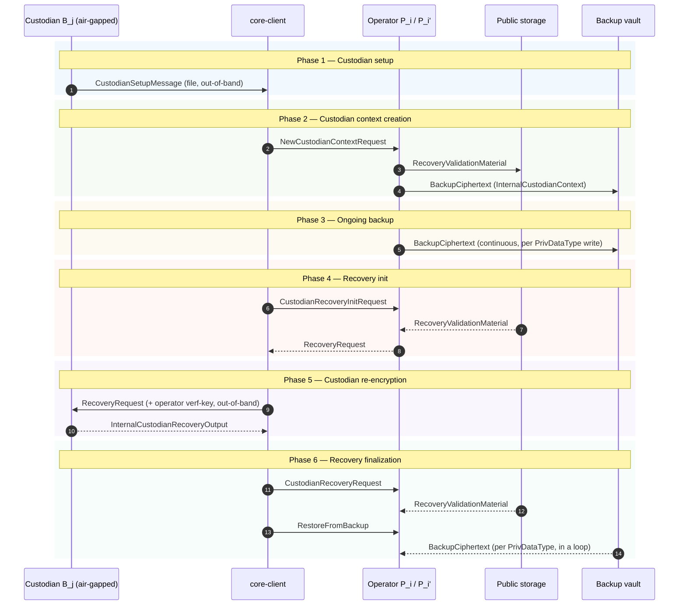

# KMS backup CLI Tool

The tool allows to make custodian keys using a BIP39 seed phrase and help operators in recovery of backups (through reencryption) by using a seed pharase.

## Prerequisites

- [Rust](https://www.rust-lang.org/tools/install). Ensure you have a recent version of Rust installed on your system. We require `v1.86` or newer.

## Usage

WARNING: This tool is only mean to be used in a highly secure setting. This means that a lot of steps must be taken to ensure security. More specifically an _air gapped_ system *must* be used.
In particular, for all usages, the following steps must be taken:
1. Construct a trusted live version of an operating system.
2. Boot this live OS on a factory new machine.
3. On a separate machine prepare necessary installation files: I.e. either Rust and the source code of this repository, or a trusted pre-compiled binary of the backup utility. 
4. These must then be copied to a factory-fresh USB stick.

### Custodian setup

Run the CLI tool with the `generate` command in order to generate keys for a custodian. More specifically:
```{bash}
$ cargo run --bin kms-custodian generate --randomness <random string of chars> --custodian-role <1-index role> --custodian-name <name of the custodian as a string> --path <path and name of the file where the custodian setup info should stored>
```
Observe that the `randomness` supplied is used along with entropy of the current system to derive keys, and thus the command is *not* idempotent. 
This will generate a fresh pair of keys for the given custodian and store this along with relevant meta-data in the directory pointed to by the path.
Furthermore, this will print a BIP39 seed phrase on the screen. This seed phrase must be copied _exactly_ on to a piece of paper. The paper should be stored securely as this is needed in order to perform recovery.

Observe the seed phrase and the private keys do not get logged or saved to disc; only printed _once_ to stdout. 

For example the command may look like this:
```{bash}
$ cargo run --bin kms-custodian generate --randomness 123 --custodian-role 3 --custodian-name homer-3 --path  core-client/tests/data/keys/CUSTODIAN/setup-msg/setup-3
```

### Key verification 

Run the CLI tool with the `verify` command in order to validate that a seed phrase is the one used to generate certain setup information. More specifically:
```{bash}
$ cargo run --bin kms-custodian verify --seed-phrase <the seed phrase used for generation> --path <path and name of the file where the custodian setup info should stored>
```
The call will print any inconsistencies found between the public keys generated from the seed phrase and those in the data supplied.

For example:
```{bash}
$ cargo run --bin kms-custodian verify --seed-phrase "stick essence exhaust bunker meat orchard wolf timber tackle gesture video cheap" --path core-client/tests/data/keys/CUSTODIAN/setup-msg/setup-3
```

### Recovery (decryption of backup)

Run the CLI tool with the `decrypt` command in order to decrypt a backup, and then reencrypt it under a supplied operator keyset. More specifically:
```bash
$ kms-backup decrypt --seed-phrase <the seed phrase used for generation> --randomness <random string of chars> --custodian-role <1-index role> --recovery-request-path <path and name of the file where the operator recovery request reside> --output-path <path and name of the file where the result of the reencryption should be stored>
```
Observe that the `randomness` supplied is used along with entropy of the current system to do re-encryption, and thus the command is *not* idempotent. 

IMPORTANT: IT IS NOT POSSIBLE FOR THE CUSTODIAN TO VALIDATE THE AUTHENTICITY OF A REQUEST! HENCE IT IS PARAMOUNT THAT IT IS VALIDATED OUT-OF-BOUNDS, E.G. THROUGH A DIGEST ON A BLOCKCHAIN.

Run the CLI tool with the `decrypt` command in order to decrypt a backup, and then reencrypt it under a supplied operator keyset. More specifically:
```{bash}
$ cargo run --bin kms-custodian decrypt --seed-phrase <the seed phrase used for generation> --randomness <random string of chars> --custodian-role <1-indexed role of the custodian> --recovery-request-path <path to the recovery information given by the operator from custodian-recovery-init> --operator-verf-key <the path to the verification key of the KMS operator> --output-path <path to store the custodian's output to the specific operator whose recovery info was given>
```
Observe that the `randomness` supplied is used along with entropy of the current system to do re-encryption, and thus the command is *not* idempotent. 

For example:
```{bash}
$ cargo run --bin kms-custodian decrypt --seed-phrase "stick essence exhaust bunker meat orchard wolf timber tackle gesture video cheap" --randomness 123  --custodian-role 1 --recovery-request-path core-client/tests/data/keys/CUSTODIAN/recovery/1 --operator-verf-key core-client/tests/data/keys/PUB-p1/VerfKey/60b7070add74be3827160aa635fb255eeeeb88586c4debf7ab1134ddceb4beee --output-path core-client/tests/data/keys/CUSTODIAN/response/recovery-response-1-1
```

---

## Protocol details

The rest of this document is background material for readers who want to understand what the CLI commands do under the hood. It is not required to use the tool.

The custodian-based backup protocol provides disaster recovery for KMS operators by Shamir-sharing a per-context backup encryption key across `n` offline custodians, tolerating up to `t` corruptions (`t < n/2`). At recovery time, `t + 1` honest custodians cooperate with the recovering operator to reconstruct the backup decryption key, which is then used to decrypt the operator's private key material from the backup vault.

The alternative backup mode — wrapping the same key under an AWS KMS CMK — is documented in [ai-docs/ARCHITECTURE.md](../../ai-docs/ARCHITECTURE.md#backup-and-recovery).

### Parties

| Party | What it does |
|---|---|
| **Custodian `B_j`** (`j = 1..n`) | Human-held, offline party. Owns a long-term signing key `sk^{S_j}` and a post-quantum encryption key `sk^{E_j}`, both deterministically derived from a BIP39 seed phrase. Stores nothing online beyond its public-key published in the `CustodianSetupMessage`. Re-signcrypts its share of the backup key on request. |
| **Operator `P_i`** (KMS node) | Online KMS server. Holds a long-term signing key `sk^{P_i}`, a TFHE secret key, and other private material that needs backing up. Receives `NewCustodianContext` and, later, `CustodianRecoveryInit` / `CustodianBackupRecovery` gRPC calls from the core-client. |
| **core-client** | The CLI that drives every gRPC call into the KMS for custodian-based backup. It bundles the operator-bound RPCs (`NewCustodianContext`, `CustodianRecoveryInit`, `CustodianBackupRecovery`, `RestoreFromBackup`) and shuttles the resulting `RecoveryRequest` / `InternalCustodianRecoveryOutput` files between the operator and the custodians out-of-band. Documented in [docs/guides/core_client.md](core_client.md). |
| **Recovering operator `P_i'`** | A fresh operator process replacing `P_i` after the latter's private storage was lost. Reads only the public storage and the backup vault; coordinates with custodians (via the core-client) to rebuild private state. |

### Data components

All names below match the Rust/proto types so you can grep for them.

| Component | Where it lives | Carries |
|---|---|---|
| [`CustodianSetupMessage`](../../core/grpc/proto/kms.v1.proto) | gRPC + custodian's `--path` file | `{ custodian_role, name, payload }`. `payload` is a versioned [`CustodianSetupMessagePayload`](../../core/service/src/backup/custodian.rs) `{ header, random_value, timestamp, public_enc_key = pk^{E_j}, verification_key = pk^{S_j} }`. |
| [`CustodianContext`](../../core/grpc/proto/kms.v1.proto) | Argument to `NewCustodianContext` RPC | `{ custodian_nodes: [CustodianSetupMessage], custodian_context_id, threshold }`. |
| [`InternalCustodianContext`](../../core/service/src/backup/custodian.rs) | Operator's private storage (replicated through the backup vault) | `{ threshold, context_id, custodian_nodes, backup_enc_key }`. `backup_enc_key = pk^{B}` is the per-context public key whose secret half is Shamir-shared to the custodians. |
| [`BackupMaterial`](../../core/service/src/backup/operator.rs) | Plaintext payload **inside** every operator→custodian signcryption | `{ backup_id (= custodian_context_id), mpc_context_id, custodian_pk = pk^{S_j}, custodian_role, operator_pk, shares: Vec<Share> }`. Authenticates the binding between operator, custodian, and context. |
| [`OperatorBackupOutput`](../../core/grpc/proto/kms.v1.proto) | gRPC value | A signcryption `(payload, pke_type, signing_type)`. Plaintext is `BackupMaterial`. Created with `(sk^{P_i}, pk^{E_j})` and the custodian's verf-key ID as `receiver_id`. |
| [`RecoveryValidationMaterial`](../../core/service/src/backup/operator.rs) | Operator's **public** storage at `custodian_context_id` | Operator-signed `{ cts: BTreeMap<Role, InnerOperatorBackupOutput>, commitments: BTreeMap<Role, H(BackupMaterial_j)>, custodian_context: InternalCustodianContext, mpc_context }`. Lets the recovering operator re-fetch the original signcryptions and verify them against the operator-signed commitments. |
| `BackupCiphertext` | Backup vault | Long-term private material (signing key, threshold FHE keys, custodian context, …) encrypted under `pk^{B}` (`backup_enc_key`). Tagged with `RequestId` + `PrivDataType` — see [ARCHITECTURE.md](../../ai-docs/ARCHITECTURE.md#backup-and-recovery). |
| [`RecoveryRequest`](../../core/grpc/proto/kms.v1.proto) | Result of `CustodianRecoveryInit` (operator → core-client → custodian's `--recovery-request-path`) | `{ ephem_op_enc_key = pk^{e_i}, cts: map<custodian_role, OperatorBackupOutput> }`. Carries (a) the operator's ephemeral encryption key for this recovery session and (b) the same signcrypted shares the operator stored at backup time. |
| [`InternalCustodianRecoveryOutput`](../../core/service/src/backup/custodian.rs) | Custodian's `--output-path` file → core-client | `{ signcryption, custodian_role }`. The signcryption is the **custodian → recovering-operator** envelope, made with `(sk^{S_j}, pk^{e_i})` over the same `BackupMaterial`. |
| [`CustodianRecoveryOutput`](../../core/grpc/proto/kms.v1.proto) | gRPC payload | Wire form of `InternalCustodianRecoveryOutput`: `{ backup_output, custodian_role }`. |
| [`CustodianRecoveryRequest`](../../core/grpc/proto/kms.v1.proto) | core-client → operator gRPC | `{ custodian_context_id, custodian_recovery_outputs: [CustodianRecoveryOutput] }`. |

### Protocol overview

The diagram below shows every message that crosses a party boundary in the six phases. Internal computation (how each party builds or validates a message) is described in the prose under each phase; here we focus only on which object is sent where.



### Phase 1 — Custodian setup (offline, one-time per custodian)

Corresponds to [`kms-custodian generate`](#custodian-setup). A future custodian boots the air-gapped machine and runs the command. Keys are deterministically derived from system entropy mixed with a user-supplied `--randomness` string; the matching BIP39 seed phrase is printed to stdout **once** and must be copied onto paper.

The seed phrase is the only durable secret the custodian holds. `sk^{E_j}` and `sk^{S_j}` are re-derived from it whenever the custodian participates in a recovery.

### Phase 2 — Custodian context creation (online, one-time per context)

The core-client gathers `n` `CustodianSetupMessage`s (from each custodian's `--path` file), picks a corruption threshold `t < n/2`, and issues a `NewCustodianContext` gRPC call to every operator in the KMS cluster. Each operator, independently: generates a per-context backup keypair `(sk^{B}, pk^{B})`, Shamir-shares `sk^{B}` into `n` shares, builds and signcrypts one `BackupMaterial` per custodian role, computes a commitment over each `BackupMaterial`, packages everything into a signed `RecoveryValidationMaterial` (written to public storage at `request_id = custodian_context_id`), and encrypts the resulting `InternalCustodianContext` into a `BackupCiphertext` for the backup vault. After secret-sharing, the operator drops `sk^{B}` and installs `pk^{B}` in its `SecretSharing` keychain.

Notes:
- The Shamir threshold encoded inside `RecoveryValidationMaterial.custodian_context.threshold` is the **recovery** threshold (`t + 1` shares needed). `Operator::new_for_sharing` enforces `t < n/2`.
- `sk^{B}` is **only** held in memory during this RPC. After secret-sharing it, the operator drops it.
- The commitment `c_j = H(BackupMaterial_j)` is what the recovering operator later checks against the decrypted material — it lets a single signature on `RecoveryValidationMaterial` authenticate every share at once, without making the encrypted plaintext public.

### Phase 3 — Ongoing backup (whenever the operator writes private material)

When the operator writes any `PrivDataType` (signing key, threshold FHE keys, custodian context itself, etc.) into private storage, the `SecretSharing` keychain wraps the bytes under `pk^{B}` and stores the resulting `BackupCiphertext` in the backup vault, tagged with the originating `RequestId` and `PrivDataType`. The custodians never see this material — only `pk^{B}` matters here.

This phase is invisible to custodians and to the core-client. It runs continuously for the life of the operator.

### Phase 4 — Recovery init (operator's private storage is gone)

The recovering operator boots against the same **public** storage and backup vault but with empty private storage. It calls `CustodianRecoveryInit`, generates an ephemeral encryption keypair `(sk^{e_i}, pk^{e_i})` pinned in process memory, reads `RecoveryValidationMaterial` from public storage at `ctx_id`, verifies the operator's signature on it, and returns a `RecoveryRequest` to the core-client (which writes it to disk for later distribution to the custodians).

The recovering operator has the same long-term signing key as the original (recovered out of band from public storage), so `RecoveryValidationMaterial`'s signature still verifies.

`sk^{e_i}` lives only in process memory; restarting the server discards it. `overwrite_ephemeral_key=true` lets a stuck recovery be re-initiated.

### Phase 5 — Custodian re-encryption (offline, manual)

Corresponds to [`kms-custodian decrypt`](#recovery-decryption-of-backup). The core-client (or operator's human operator) distributes the `RecoveryRequest` and the recovering operator's verification key out-of-band to each custodian's air-gapped machine. The custodian boots, types in the seed phrase, and runs the command: re-derives `(sk^{E_j}, sk^{S_j})` from the seed phrase, unsigncrypts its share of `BackupMaterial` from `cts[j]`, sanity-checks the metadata inside and then re-signcrypts the same `BackupMaterial` to the operator's ephemeral key `pk^{e_i}`, and writes the resulting `InternalCustodianRecoveryOutput` to `--output-path`.

The custodian's only cryptographic obligation is "decrypt your share and re-signcrypt it for the operator's ephemeral key". The custodian can't (and isn't asked to) judge whether this request is legitimate — see the warning at the top of the [Recovery](#recovery-decryption-of-backup) section.

### Phase 6 — Recovery finalization (operator reconstructs)

The core-client collects `t + 1` (or more) custodian output files and sends them, in a single `CustodianRecoveryRequest`, to every operator in the cluster. The recovering operator re-reads `RecoveryValidationMaterial` from public storage and validates each `CustodianRecoveryOutput`, and once at least `t + 1` shares pass — Shamir-reconstructs `sk^{B}` and installs it in the `SecretSharing` keychain. A subsequent `RestoreFromBackup` call then iterates every `BackupCiphertext` in the backup vault, decrypts each with `sk^{B}`, and writes the plaintext into the now-empty private storage.

After Phase 6 the recovering operator's private storage is repopulated and the node resumes normal service. The operator-side commands that drive Phases 4 and 6 are documented in [docs/guides/core_client.md](core_client.md).
