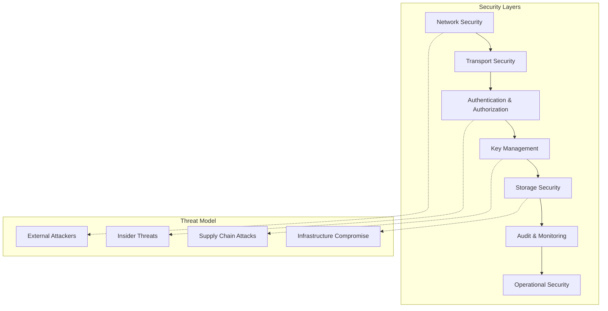

# KMS Security Checklist & Hardening

This guide provides security best practices, hardening procedures, and compliance guidelines for KMS deployments.

## Security Overview

KMS security involves multiple layers:



## Network Security

### Firewall Configuration

```bash
#!/bin/bash
# kms-firewall.sh - Configure firewall rules

# Allow KMS gRPC port (50100) only from authorized sources
iptables -A INPUT -p tcp --dport 50100 -s 10.0.0.0/8 -j ACCEPT
iptables -A INPUT -p tcp --dport 50100 -s 172.16.0.0/12 -j ACCEPT
iptables -A INPUT -p tcp --dport 50100 -s 192.168.0.0/16 -j ACCEPT

# Allow threshold P2P port (50001) only between KMS nodes
iptables -A INPUT -p tcp --dport 50001 -s 10.0.1.0/24 -j ACCEPT  # KMS subnet

# Allow metrics port (9646) only from monitoring systems
iptables -A INPUT -p tcp --dport 9646 -s 10.0.2.0/24 -j ACCEPT  # Monitoring subnet

# Allow SSH only from management network
iptables -A INPUT -p tcp --dport 22 -s 10.0.3.0/24 -j ACCEPT    # Management subnet

# Block all other traffic to KMS ports
iptables -A INPUT -p tcp --dport 50000:50200 -j DROP
iptables -A INPUT -p tcp --dport 9646 -j DROP

# Log dropped packets for security monitoring
iptables -A INPUT -j LOG --log-prefix "KMS-FIREWALL-DROP: "
iptables -A INPUT -j DROP

echo "SUCCESS: Firewall rules configured"
```

### Network Segmentation

```yaml
# kubernetes-network-policy.yaml
apiVersion: networking.k8s.io/v1
kind: NetworkPolicy
metadata:
  name: kms-network-policy
  namespace: kms
spec:
  podSelector:
    matchLabels:
      app: kms
  policyTypes:
  - Ingress
  - Egress
  
  ingress:
  # Allow gRPC traffic from authorized clients
  - from:
    - namespaceSelector:
        matchLabels:
          name: kms-clients
    - podSelector:
        matchLabels:
          role: kms-client
    ports:
    - protocol: TCP
      port: 50100
  
  # Allow P2P traffic between KMS nodes
  - from:
    - podSelector:
        matchLabels:
          app: kms
    ports:
    - protocol: TCP
      port: 50001
  
  # Allow monitoring traffic
  - from:
    - namespaceSelector:
        matchLabels:
          name: monitoring
    ports:
    - protocol: TCP
      port: 9646
  
  egress:
  # Allow outbound to storage backends
  - to: []
    ports:
    - protocol: TCP
      port: 443  # HTTPS for S3/cloud storage
    - protocol: TCP
      port: 5432 # PostgreSQL
  
  # Allow DNS resolution
  - to: []
    ports:
    - protocol: UDP
      port: 53
```

## Transport Security (TLS)

### Certificate Management

```bash
#!/bin/bash
# generate-kms-certs.sh - Generate TLS certificates for KMS

CERT_DIR="/opt/kms/certs"
CA_KEY="$CERT_DIR/ca-key.pem"
CA_CERT="$CERT_DIR/ca-cert.pem"
VALIDITY_DAYS=365

mkdir -p "$CERT_DIR"
cd "$CERT_DIR"

# Generate CA private key
openssl genrsa -out "$CA_KEY" 4096

# Generate CA certificate
openssl req -new -x509 -key "$CA_KEY" -out "$CA_CERT" -days $VALIDITY_DAYS \
    -subj "/C=US/ST=CA/L=San Francisco/O=KMS/CN=KMS-CA"

# Function to generate server certificate
generate_server_cert() {
    local hostname="$1"
    local server_key="$CERT_DIR/${hostname}-key.pem"
    local server_csr="$CERT_DIR/${hostname}.csr"
    local server_cert="$CERT_DIR/${hostname}-cert.pem"
    
    # Generate server private key
    openssl genrsa -out "$server_key" 2048
    
    # Generate certificate signing request
    openssl req -new -key "$server_key" -out "$server_csr" \
        -subj "/C=US/ST=CA/L=San Francisco/O=KMS/CN=$hostname"
    
    # Create certificate extensions
    cat > "${hostname}.ext" << EOF
authorityKeyIdentifier=keyid,issuer
basicConstraints=CA:FALSE
keyUsage = digitalSignature, nonRepudiation, keyEncipherment, dataEncipherment
subjectAltName = @alt_names

[alt_names]
DNS.1 = $hostname
DNS.2 = localhost
IP.1 = 127.0.0.1
EOF
    
    # Generate server certificate
    openssl x509 -req -in "$server_csr" -CA "$CA_CERT" -CAkey "$CA_KEY" \
        -CAcreateserial -out "$server_cert" -days $VALIDITY_DAYS \
        -extensions v3_req -extfile "${hostname}.ext"
    
    # Set secure permissions
    chmod 600 "$server_key"
    chmod 644 "$server_cert"
    
    echo "SUCCESS: Generated certificate for $hostname"
}

# Generate certificates for each KMS node
generate_server_cert "kms-centralized"
# Generate certificate for your party
generate_server_cert "kms-party-${PARTY_ID}"

# Set CA permissions
chmod 600 "$CA_KEY"
chmod 644 "$CA_CERT"

echo "SUCCESS: All certificates generated in $CERT_DIR"
```

### TLS Configuration

```toml
# TLS-enabled KMS configuration
[service]
listen_address = "0.0.0.0"
listen_port = 50100
tls_cert_path = "/app/certs/kms-server-cert.pem"
tls_key_path = "/app/certs/kms-server-key.pem"
# Optional: Client certificate verification
tls_ca_cert_path = "/app/certs/ca-cert.pem"
tls_client_auth_required = true

[threshold]
listen_address = "0.0.0.0"
listen_port = 50001

[[threshold.peers]]
party_id = 1
address = "party1-external.kms-threshold.svc.cluster.local"
port = 50001
tls_cert = "/app/certs/party1-cert.pem"

[[threshold.peers]]
party_id = 2
address = "party2-external.kms-threshold.svc.cluster.local"
port = 50001
tls_cert = "/app/certs/party2-cert.pem"

# ... continue for all 13 parties
```

### Certificate Rotation

```bash
#!/bin/bash
# rotate-certs.sh - Automated certificate rotation

CERT_DIR="/opt/kms/certs"
BACKUP_DIR="/opt/kms/certs/backup/$(date +%Y%m%d_%H%M%S)"
RENEWAL_THRESHOLD_DAYS=30

# Function to check certificate expiry
check_cert_expiry() {
    local cert_file="$1"
    local expiry_date=$(openssl x509 -enddate -noout -in "$cert_file" | cut -d= -f2)
    local expiry_epoch=$(date -d "$expiry_date" +%s)
    local current_epoch=$(date +%s)
    local days_until_expiry=$(( (expiry_epoch - current_epoch) / 86400 ))
    
    echo "$days_until_expiry"
}

# Function to rotate certificate
rotate_certificate() {
    local hostname="$1"
    local cert_file="$CERT_DIR/${hostname}-cert.pem"
    local key_file="$CERT_DIR/${hostname}-key.pem"
    
    echo "INFO: Rotating certificate for $hostname"
    
    # Backup existing certificates
    mkdir -p "$BACKUP_DIR"
    cp "$cert_file" "$BACKUP_DIR/"
    cp "$key_file" "$BACKUP_DIR/"
    
    # Generate new certificate
    generate_server_cert "$hostname"
    
    # Restart KMS service to load new certificate
    if systemctl is-active --quiet kms; then
        systemctl reload kms
    elif docker ps | grep -q kms; then
        docker-compose restart kms-server
    fi
    
    echo "SUCCESS: Certificate rotated for $hostname"
}

# Check all certificates
for cert in "$CERT_DIR"/*-cert.pem; do
    if [ -f "$cert" ]; then
        hostname=$(basename "$cert" -cert.pem)
        days_left=$(check_cert_expiry "$cert")
        
        echo "Certificate $hostname expires in $days_left days"
        
        if [ "$days_left" -le "$RENEWAL_THRESHOLD_DAYS" ]; then
            rotate_certificate "$hostname"
        fi
    fi
done
```

## 🔑 Key Management Security

### Key Generation Security

```bash
#!/bin/bash
# secure-key-generation.sh - Secure key generation procedures

KEY_DIR="/opt/kms/keys"
ENTROPY_SOURCE="/dev/random"  # Use /dev/random for high-quality entropy

# Ensure sufficient entropy
echo "INFO: Checking system entropy..."
ENTROPY_AVAILABLE=$(cat /proc/sys/kernel/random/entropy_avail)
if [ "$ENTROPY_AVAILABLE" -lt 1000 ]; then
    echo "WARNING: Low entropy detected ($ENTROPY_AVAILABLE). Installing haveged..."
    apt-get update && apt-get install -y haveged
    systemctl enable haveged
    systemctl start haveged
fi

# Secure key directory permissions
mkdir -p "$KEY_DIR"
chmod 700 "$KEY_DIR"
chown kms:kms "$KEY_DIR"

# Generate keys with secure permissions
umask 077  # Ensure new files are created with 600 permissions

echo "SUCCESS: Key generation environment secured"
```

### Key Storage Security

```toml
# Secure storage configuration with encryption
[private_vault]
[private_vault.storage]
S3 = { 
  bucket = "kms-secure-private-keys",
  region = "us-west-2",
  prefix = "prod/encrypted/",
  # Server-side encryption with customer-managed keys
  encryption = "aws:kms",
  kms_key_id = "arn:aws:kms:us-west-2:123456789012:key/12345678-1234-1234-1234-123456789012",
  # Additional client-side encryption layer
  client_side_encryption = true,
  client_encryption_key_id = "kms-client-encryption-key"
}

[public_vault]
[public_vault.storage]
S3 = { 
  bucket = "kms-secure-public-keys",
  region = "us-west-2",
  prefix = "prod/",
  encryption = "AES256"
}
```

### Hardware Security Module (HSM) Integration

```toml
# HSM-backed key storage configuration
[private_vault]
[private_vault.storage]
HSM = {
  provider = "pkcs11",
  library_path = "/usr/lib/softhsm/libsofthsm2.so",
  slot_id = 0,
  pin = "${HSM_PIN}",  # Use environment variable
  key_label_prefix = "kms-prod-"
}
```

## Access Control & Authentication

### Role-Based Access Control (RBAC)

```yaml
# kms-rbac.yaml - Kubernetes RBAC configuration
apiVersion: rbac.authorization.k8s.io/v1
kind: Role
metadata:
  namespace: kms
  name: kms-operator
rules:
# Allow reading KMS pods and services
- apiGroups: [""]
  resources: ["pods", "services", "configmaps", "secrets"]
  verbs: ["get", "list", "watch"]
# Allow updating KMS deployments
- apiGroups: ["apps"]
  resources: ["deployments", "statefulsets"]
  verbs: ["get", "list", "watch", "update", "patch"]
# Allow reading logs
- apiGroups: [""]
  resources: ["pods/log"]
  verbs: ["get", "list"]

---
apiVersion: rbac.authorization.k8s.io/v1
kind: RoleBinding
metadata:
  name: kms-operators
  namespace: kms
subjects:
- kind: User
  name: kms-operator-1
  apiGroup: rbac.authorization.k8s.io
- kind: User
  name: kms-operator-2
  apiGroup: rbac.authorization.k8s.io
roleRef:
  kind: Role
  name: kms-operator
  apiGroup: rbac.authorization.k8s.io
```

### Service Account Security

```yaml
# kms-service-account.yaml
apiVersion: v1
kind: ServiceAccount
metadata:
  name: kms-service-account
  namespace: kms
automountServiceAccountToken: false  # Disable automatic token mounting

---
apiVersion: v1
kind: Secret
metadata:
  name: kms-service-account-token
  namespace: kms
  annotations:
    kubernetes.io/service-account.name: kms-service-account
type: kubernetes.io/service-account-token

---
# Mount token manually in deployment
apiVersion: apps/v1
kind: Deployment
metadata:
  name: kms-server
spec:
  template:
    spec:
      serviceAccountName: kms-service-account
      containers:
      - name: kms-server
        volumeMounts:
        - name: service-account-token
          mountPath: /var/run/secrets/kubernetes.io/serviceaccount
          readOnly: true
      volumes:
      - name: service-account-token
        secret:
          secretName: kms-service-account-token
```

## Audit & Monitoring

### Security Event Logging

```toml
# Enhanced logging configuration for security events
[telemetry]
tracing_service_name = "kms-production"
tracing_endpoint = "https://security-logs.example.com/api/traces"

# Security-specific log levels
[logging]
security_events = "INFO"
authentication = "INFO"
authorization = "WARN"
key_operations = "INFO"
network_events = "WARN"
```

### Security Monitoring Rules

```yaml
# security-alerts.yml - Security-focused alerting rules
groups:
- name: kms-security
  rules:
  
  # Authentication failures
  - alert: KMSAuthenticationFailures
    expr: rate(kms_authentication_failures_total[5m]) > 5
    for: 1m
    labels:
      severity: warning
      category: security
    annotations:
      summary: "High authentication failure rate on {{ $labels.instance }}"
      description: "{{ $value }} authentication failures per second"
  
  # Unauthorized access attempts
  - alert: KMSUnauthorizedAccess
    expr: rate(kms_unauthorized_requests_total[5m]) > 1
    for: 30s
    labels:
      severity: critical
      category: security
    annotations:
      summary: "Unauthorized access attempts on {{ $labels.instance }}"
      description: "{{ $value }} unauthorized requests per second"
  
  # Key operation anomalies
  - alert: KMSKeyOperationAnomaly
    expr: |
      rate(kms_key_operations_total[5m]) > 
      (avg_over_time(rate(kms_key_operations_total[5m])[1h]) * 3)
    for: 5m
    labels:
      severity: warning
      category: security
    annotations:
      summary: "Unusual key operation rate on {{ $labels.instance }}"
      description: "Key operations 3x higher than normal"
  
  # Certificate expiry warnings
  - alert: KMSCertificateExpiring
    expr: kms_certificate_expiry_days < 30
    for: 1h
    labels:
      severity: warning
      category: security
    annotations:
      summary: "KMS certificate expiring soon"
      description: "Certificate {{ $labels.cert_name }} expires in {{ $value }} days"
  
  # Network connection anomalies
  - alert: KMSUnusualConnections
    expr: |
      rate(kms_network_connections_total[5m]) > 
      (avg_over_time(rate(kms_network_connections_total[5m])[1h]) * 5)
    for: 2m
    labels:
      severity: warning
      category: security
    annotations:
      summary: "Unusual network connection rate"
      description: "Connection rate 5x higher than normal"
```

### Intrusion Detection

```bash
#!/bin/bash
# kms-ids.sh - Intrusion Detection System for KMS

LOG_FILE="/var/log/kms/security.log"
ALERT_THRESHOLD=10
ALERT_EMAIL="security@example.com"

# Function to check for suspicious patterns
check_suspicious_activity() {
    local pattern="$1"
    local description="$2"
    local count
    
    count=$(grep -c "$pattern" "$LOG_FILE" 2>/dev/null || echo 0)
    
    if [ "$count" -gt "$ALERT_THRESHOLD" ]; then
        echo "SECURITY ALERT: $description"
        echo "Pattern: $pattern"
        echo "Occurrences: $count"
        
        # Send alert email
        echo "Security alert for KMS: $description ($count occurrences)" | \
            mail -s "KMS Security Alert" "$ALERT_EMAIL"
    fi
}

# Check for various suspicious patterns
check_suspicious_activity "authentication failed" "Multiple authentication failures"
check_suspicious_activity "unauthorized access" "Unauthorized access attempts"
check_suspicious_activity "invalid certificate" "Invalid certificate usage"
check_suspicious_activity "connection refused" "Connection refusal patterns"
check_suspicious_activity "rate limit exceeded" "Rate limiting triggered"

# Check for unusual file access patterns
find /opt/kms/keys -type f -amin -60 | while read -r file; do
    echo "WARNING: Key file accessed recently: $file"
done

# Monitor network connections
netstat -an | grep :50100 | wc -l | while read -r conn_count; do
    if [ "$conn_count" -gt 100 ]; then
        echo "WARNING: High connection count: $conn_count"
    fi
done
```

## Container Security

### Secure Container Configuration

```yaml
# secure-kms-deployment.yaml
apiVersion: apps/v1
kind: Deployment
metadata:
  name: kms-secure
  namespace: kms
spec:
  template:
    spec:
      # Security context for the pod
      securityContext:
        runAsNonRoot: true
        runAsUser: 1000
        runAsGroup: 1000
        fsGroup: 1000
        seccompProfile:
          type: RuntimeDefault
      
      containers:
      - name: kms-server
        image: ghcr.io/zama-ai/kms/core-service:latest
        
        # Container security context
        securityContext:
          allowPrivilegeEscalation: false
          readOnlyRootFilesystem: true
          runAsNonRoot: true
          runAsUser: 1000
          runAsGroup: 1000
          capabilities:
            drop:
            - ALL
            add:
            - NET_BIND_SERVICE  # Only if binding to privileged ports
        
        # Resource limits
        resources:
          limits:
            memory: "16Gi"
            cpu: "8"
            ephemeral-storage: "10Gi"
          requests:
            memory: "8Gi"
            cpu: "4"
            ephemeral-storage: "5Gi"
        
        # Writable volumes for logs and temporary files
        volumeMounts:
        - name: tmp
          mountPath: /tmp
        - name: logs
          mountPath: /app/logs
        - name: keys
          mountPath: /app/keys
          readOnly: false
        - name: config
          mountPath: /app/config
          readOnly: true
        
      volumes:
      - name: tmp
        emptyDir:
          sizeLimit: "1Gi"
      - name: logs
        emptyDir:
          sizeLimit: "5Gi"
      - name: keys
        persistentVolumeClaim:
          claimName: kms-keys-pvc
      - name: config
        secret:
          secretName: kms-config
          defaultMode: 0400
```

### Image Security Scanning

```bash
#!/bin/bash
# scan-kms-image.sh - Security scan KMS container images

IMAGE="ghcr.io/zama-ai/kms/core-service:latest"
SCAN_RESULTS="/tmp/kms-scan-results.json"

echo "INFO: Scanning KMS image for vulnerabilities..."

# Use Trivy for vulnerability scanning
trivy image --format json --output "$SCAN_RESULTS" "$IMAGE"

# Check for critical vulnerabilities
CRITICAL_COUNT=$(jq '.Results[].Vulnerabilities[] | select(.Severity == "CRITICAL") | .VulnerabilityID' "$SCAN_RESULTS" | wc -l)
HIGH_COUNT=$(jq '.Results[].Vulnerabilities[] | select(.Severity == "HIGH") | .VulnerabilityID' "$SCAN_RESULTS" | wc -l)

echo "Critical vulnerabilities: $CRITICAL_COUNT"
echo "High vulnerabilities: $HIGH_COUNT"

if [ "$CRITICAL_COUNT" -gt 0 ]; then
    echo "CRITICAL: vulnerabilities found! Image should not be deployed."
    exit 1
elif [ "$HIGH_COUNT" -gt 5 ]; then
    echo "WARNING: High number of HIGH severity vulnerabilities. Review required."
    exit 1
else
    echo "SUCCESS: Image security scan passed"
fi
```

## Secrets Management

### Kubernetes Secrets Security

```bash
#!/bin/bash
# secure-secrets.sh - Secure secrets management

NAMESPACE="kms"
SECRET_NAME="kms-secrets"

# Create sealed secret (requires sealed-secrets controller)
kubectl create secret generic "$SECRET_NAME" \
    --from-literal=database-password="$(openssl rand -base64 32)" \
    --from-literal=encryption-key="$(openssl rand -base64 32)" \
    --from-literal=signing-key="$(openssl rand -base64 32)" \
    --dry-run=client -o yaml | \
    kubeseal --format yaml > "${SECRET_NAME}-sealed.yaml"

# Apply sealed secret
kubectl apply -f "${SECRET_NAME}-sealed.yaml" -n "$NAMESPACE"

echo "SUCCESS: Sealed secret created and applied"
```

### External Secrets Integration

```yaml
# external-secrets.yaml - HashiCorp Vault integration
apiVersion: external-secrets.io/v1beta1
kind: SecretStore
metadata:
  name: vault-backend
  namespace: kms
spec:
  provider:
    vault:
      server: "https://vault.example.com"
      path: "secret"
      version: "v2"
      auth:
        kubernetes:
          mountPath: "kubernetes"
          role: "kms-role"

---
apiVersion: external-secrets.io/v1beta1
kind: ExternalSecret
metadata:
  name: kms-vault-secrets
  namespace: kms
spec:
  refreshInterval: 15s
  secretStoreRef:
    name: vault-backend
    kind: SecretStore
  target:
    name: kms-secrets
    creationPolicy: Owner
  data:
  - secretKey: database-password
    remoteRef:
      key: kms/database
      property: password
  - secretKey: encryption-key
    remoteRef:
      key: kms/encryption
      property: key
```

## Security Compliance

### Security Hardening Checklist

#### Network Security
- [ ] Firewall rules configured to allow only necessary traffic
- [ ] Network segmentation implemented
- [ ] VPN or private network access for management
- [ ] DDoS protection enabled
- [ ] Intrusion detection system deployed

#### Transport Security
- [ ] TLS 1.3 enabled for all communications
- [ ] Strong cipher suites configured
- [ ] Certificate validation enforced
- [ ] Certificate rotation automated
- [ ] Perfect Forward Secrecy enabled

#### Authentication & Authorization
- [ ] Strong authentication mechanisms implemented
- [ ] Multi-factor authentication enabled for admin access
- [ ] Role-based access control configured
- [ ] Principle of least privilege enforced
- [ ] Regular access reviews conducted

#### Key Management
- [ ] Hardware security modules used (where applicable)
- [ ] Key generation uses cryptographically secure random sources
- [ ] Keys encrypted at rest
- [ ] Key rotation procedures implemented
- [ ] Key backup and recovery tested

#### Container Security
- [ ] Container images scanned for vulnerabilities
- [ ] Non-root user configured
- [ ] Read-only root filesystem enabled
- [ ] Security contexts properly configured
- [ ] Resource limits enforced

#### Monitoring & Auditing
- [ ] Security event logging enabled
- [ ] Log integrity protection implemented
- [ ] Security monitoring rules configured
- [ ] Incident response procedures documented
- [ ] Regular security assessments conducted

### Compliance Frameworks

#### SOC 2 Type II Compliance

```bash
#!/bin/bash
# soc2-compliance-check.sh - SOC 2 compliance verification

echo "INFO: SOC 2 Compliance Check for KMS"

# Security - Access controls
echo "Checking access controls..."
kubectl get rolebindings -n kms
kubectl get networkpolicies -n kms

# Availability - Monitoring and alerting
echo "Checking monitoring configuration..."
curl -s http://prometheus:9090/api/v1/rules | jq '.data.groups[].rules[] | select(.alert)'

# Processing Integrity - Data validation
echo "Checking data integrity controls..."
# Verify checksums, signatures, etc.

# Confidentiality - Encryption
echo "Checking encryption configuration..."
grep -i encryption /opt/kms/config/*.toml

# Privacy - Data handling
echo "Checking data retention policies..."
# Verify log retention, key lifecycle, etc.

echo "SUCCESS: SOC 2 compliance check completed"
```

#### FIPS 140-2 Compliance

```toml
# FIPS-compliant configuration
[cryptography]
fips_mode = true
approved_algorithms_only = true
key_generation_entropy_source = "/dev/random"

[tls]
cipher_suites = [
    "TLS_AES_256_GCM_SHA384",
    "TLS_CHACHA20_POLY1305_SHA256",
    "TLS_AES_128_GCM_SHA256"
]
min_version = "1.3"
```

### Security Assessment

```bash
#!/bin/bash
# security-assessment.sh - Automated security assessment

REPORT_FILE="/tmp/kms-security-assessment-$(date +%Y%m%d).txt"

echo "INFO: KMS Security Assessment - $(date)" > "$REPORT_FILE"
echo "================================================" >> "$REPORT_FILE"

# Check TLS configuration
echo "TLS Configuration:" >> "$REPORT_FILE"
nmap --script ssl-enum-ciphers -p 50100 localhost >> "$REPORT_FILE" 2>&1

# Check file permissions
echo -e "\nFile Permissions:" >> "$REPORT_FILE"
find /opt/kms -type f -exec ls -la {} \; >> "$REPORT_FILE"

# Check running processes
echo -e "\nRunning Processes:" >> "$REPORT_FILE"
ps aux | grep kms >> "$REPORT_FILE"

# Check network connections
echo -e "\nNetwork Connections:" >> "$REPORT_FILE"
netstat -tlnp | grep -E "(50100|50001|9646)" >> "$REPORT_FILE"

# Check system updates
echo -e "\nSystem Updates:" >> "$REPORT_FILE"
apt list --upgradable 2>/dev/null >> "$REPORT_FILE"

# Check container security
if command -v docker >/dev/null; then
    echo -e "\nContainer Security:" >> "$REPORT_FILE"
    docker inspect kms-container | jq '.[]SecurityOpt' >> "$REPORT_FILE" 2>&1
fi

echo "SUCCESS: Security assessment completed: $REPORT_FILE"
```

## Incident Response

### Security Incident Response Plan

1. **Detection & Analysis**
   - Monitor security alerts and logs
   - Analyze potential security incidents
   - Determine incident severity and scope

2. **Containment**
   - Isolate affected systems
   - Prevent further damage
   - Preserve evidence

3. **Eradication & Recovery**
   - Remove threats from environment
   - Restore systems from clean backups
   - Apply security patches

4. **Post-Incident Activities**
   - Document lessons learned
   - Update security procedures
   - Conduct post-incident review

### Emergency Response Scripts

```bash
#!/bin/bash
# emergency-response.sh - Emergency security response

INCIDENT_TYPE="$1"
SEVERITY="$2"

case "$INCIDENT_TYPE" in
    "compromise")
        echo "ALERT: SECURITY COMPROMISE DETECTED"
        # Isolate affected systems
        kubectl scale deployment kms-server --replicas=0 -n kms
        # Block network access
        kubectl apply -f emergency-network-policy.yaml
        ;;
        
    "data-breach")
        echo "ALERT: DATA BREACH DETECTED"
        # Stop all KMS services
        kubectl delete deployment kms-server -n kms
        # Notify security team
        curl -X POST "$SECURITY_WEBHOOK" -d '{"alert":"KMS Data Breach"}'
        ;;
        
    "unauthorized-access")
        echo "ALERT: UNAUTHORIZED ACCESS DETECTED"
        # Revoke all active sessions
        kubectl delete secret kms-session-tokens -n kms
        # Force certificate rotation
        ./rotate-certs.sh --emergency
        ;;
esac

# Log incident
echo "$(date): Security incident $INCIDENT_TYPE (severity: $SEVERITY)" >> /var/log/kms/security-incidents.log
```

---

## Related Documentation

- [Configuration Management](../configuration.md) - Secure configuration practices
- [Metrics & Monitoring](metrics.md) - Security monitoring and alerting
- [Deployment Guide](deployment.md) - Secure deployment procedures
- [Troubleshooting Guide](troubleshooting.md) - Security-related issue resolution
