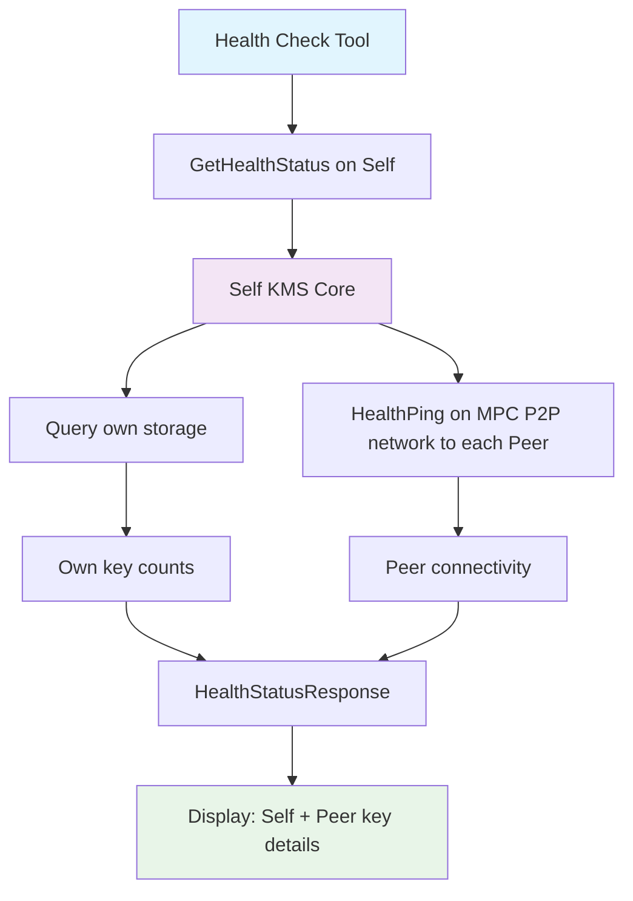

# KMS Health Check Tool

Health monitoring tool for Zama KMS deployments. Validates configurations, checks connectivity, and verifies key material for both centralized and threshold KMS instances.

__NOTE__: This tool uses the MPC P2P connection between the peers to perform the healthcheck.

## Features

- **Config Validation**: Parse and validate KMS configuration files using actual KMS server validation logic
- **Connectivity Check**: Test gRPC endpoint connectivity and latency
- **Key Material Check**: Display actual key IDs for FHE keys, CRS keys, and preprocessing material
- **Peer Health**: Check connectivity to all threshold peers with detailed key information
- **JSON Output**: Machine-readable output for CI/CD integration

## Usage

```bash
# Install
cargo build --release -p kms-health-check

# Validate config only
kms-health-check config --file /path/to/config.toml

# Check running instance
kms-health-check live --endpoint localhost:50100

# Full check (config + running instance)
kms-health-check full --config /path/to/config.toml --endpoint localhost:50100

# JSON output for monitoring
kms-health-check --format json full --config /path/to/config.toml --endpoint localhost:50100

# Using custom timeout configuration
kms-health-check live --endpoint localhost:50100 --health-config health-check.toml

# Using environment variables for timeouts (note the double underscore separator)
HEALTH_CHECK__CONNECTION_TIMEOUT_SECS=10 HEALTH_CHECK__REQUEST_TIMEOUT_SECS=30 kms-health-check live --endpoint localhost:50100
```

## Configuration

The health check tool supports configurable timeouts through a dedicated configuration file and environment variables.

### Health Check Configuration File

Create a `health-check.toml` file to configure timeout settings:

```toml
# Health Check Tool Configuration
# Connection timeout in seconds (default: 5)
connection_timeout_secs = 5

# Request timeout in seconds (default: 10)
request_timeout_secs = 10
```

Use the configuration file with the `--health-config` flag:

```bash
kms-health-check live --endpoint localhost:50100 --health-config health-check.toml
```

### Environment Variables

All configuration settings can be overridden with environment variables using the `HEALTH_CHECK_` prefix:

| Environment Variable | Description | Default |
|---------------------|-------------|---------|
| `HEALTH_CHECK__CONNECTION_TIMEOUT_SECS` | Connection timeout in seconds | 5 |
| `HEALTH_CHECK__REQUEST_TIMEOUT_SECS` | Request timeout in seconds | 10 |

Examples:

```bash
# Set custom timeouts via environment variables (note the double underscore separator)
export HEALTH_CHECK__CONNECTION_TIMEOUT_SECS=10
export HEALTH_CHECK__REQUEST_TIMEOUT_SECS=30
kms-health-check live --endpoint localhost:50100

# Or inline
HEALTH_CHECK__CONNECTION_TIMEOUT_SECS=15 kms-health-check live --endpoint localhost:50100
```

### Configuration Precedence

Configuration values are applied in the following order (highest precedence first):

1. Environment variables (`HEALTH_CHECK__*`)
2. Configuration file (`--health-config`)
3. Default values


## Example Output

```
[INFO]:
  [OK] Valid threshold config
  [OK] Storage: File(FileStorage { path: "./keys" })
  [OK] Listen address: 0.0.0.0:50300
  [OK] Threshold: 1 - Node requirements:
      - 2 of 4 nodes minimum for threshold operations (t+1)
      - 3 of 4 nodes for healthy status (2/3 majority)
      - 4 of 4 nodes for optimal status (all nodes online)
      (!!!)  Operational recommendation: All 4 nodes should be online for best performance
  [OK] 4 peers configured:
      - Peer 1 at abcd.dev-kms-core-1.com:50001
      - Peer 2 at abcd.dev-kms-core-2.com:50002
      - Peer 3 at abcd.dev-kms-core-3.com:50003
      - Peer 4 at abcd.dev-kms-core-4.com:50004

[KMS HEALTH CHECK REPORT]
==================================================

[OK] Overall Status: Healthy - Sufficient majority

[CONFIG]:
  [OK] Valid threshold config
  [OK] Storage: File(FileStorage { path: "./keys" })

[CONNECTIVITY]:
  [OK] Reachable (latency: 2ms)

[KEY MATERIAL]:
  [OK] FHE Keys: 1
       - b1f8a080bd63e357b16e37eafb555a2d739d6a8f6bb13a2b3b9840cc45618b33
  [OK] CRS: 0
  [OK] Preprocessing: 0
  [OK] Storage: Threshold KMS - file storage with root_path '/app/kms/core/service/keys/PRIV-p3'

[OPERATOR KEY]:
  [FAIL] Not available: status: Unimplemented, message: "Backup vault does not support operator public key retrieval", details: [], metadata: MetadataMap { headers: {"content-type": "application/grpc", "date": "Thu, 25 Sep 2025 13:23:53 GMT"} }

[CONTEXT 0101010101010101010101010101010101010101010101010101010101020304]:

  [NODE INFO]:
    Type: threshold
    Party ID: 3
    Threshold: 2 required
    Nodes Reachable: 4

  [PEER STATUS]:
    3 of 3 peers reachable
    [OK] Party 1 @ abcd.dev-kms-core-1.com (17ms)
    [OK] Party 2 @ abcd.dev-kms-core-2.com (17ms)
    [OK] Party 4 @ abcd.dev-kms-core-4.com (17ms)

  Optimal: All 3 peers online and reachable

==================================================
```

## Health Status Levels

- **Optimal**: All nodes online and reachable, perfect operational state
- **Healthy**: Sufficient 2/3 majority but not all nodes online, functional but should investigate offline nodes
- **Degraded**: At least threshold + 1 but below 2/3 majority, operational with reduced fault tolerance
- **Unhealthy**: Insufficient nodes for operations, critical issues requiring immediate attention

## Output Format

Default is text with colors. Use `--format json` for machine-readable output.

## gRPC Health Endpoints

The KMS exposes two complementary gRPC endpoints for health monitoring and key material inspection:



### Endpoint
- **Service**: `kms.v1.CoreService`
- **Method**: `GetHealthStatus(Empty) -> HealthStatusResponse`
- **Additional**: `GetKeyMaterialAvailability(Empty) -> KeyMaterialAvailabilityResponse`
- **Ports**: 50100 (default KMS port)

### Response Structure

```protobuf
// Health status levels
enum HealthStatus {
  HEALTH_STATUS_UNSPECIFIED = 0;
  HEALTH_STATUS_OPTIMAL = 1;     // All nodes online and reachable
  HEALTH_STATUS_HEALTHY = 2;     // Sufficient 2/3 majority but not all nodes
  HEALTH_STATUS_DEGRADED = 3;    // Above minimum threshold but below 2/3
  HEALTH_STATUS_UNHEALTHY = 4;   // Insufficient nodes for operations
}

// Node type for KMS deployment
enum NodeType {
  NODE_TYPE_UNSPECIFIED = 0;
  NODE_TYPE_CENTRALIZED = 1;
  NODE_TYPE_THRESHOLD = 2;
}


  // Health information for a peer node
  message PeerHealth {
    // Peer party ID (for threshold mode)
    uint32 peer_id = 1;
    // Peer endpoint address
    string endpoint = 2;
    // Whether the peer is reachable
    bool reachable = 3;
    // Connection latency in milliseconds
    uint32 latency_ms = 4;
    // Error message if peer is unreachable
    string error = 5;
  }

  message PeersFromContext {
    RequestId context_id = 1;
    uint32 my_party_id = 2;
    uint32 threshold_required = 3; // Minimum nodes needed
    uint32 nodes_reachable = 4; // Currently reachable nodes
    HealthStatus status = 5; // Overall health status
    repeated PeerHealth peers = 6;
  }

// Response containing comprehensive health status
message HealthStatusResponse {
  // Health status of all peers for every contexts
  repeated PeersFromContext peers_from_all_contexts = 1;

  // Self key material IDs and storage info
  repeated string my_fhe_key_ids = 2;
  repeated string my_crs_ids = 3;
  repeated string my_preprocessing_key_ids = 4;
  string my_storage_info = 5;

  // Runtime configuration info
  NodeType node_type = 6;

}
```

### Key Material Availability Response

The health check tool now uses the `GetKeyMaterialAvailability` endpoint to display actual key IDs:

```protobuf
message KeyMaterialAvailabilityResponse {
  repeated string fhe_key_ids = 1;
  repeated string crs_ids = 2;
  repeated string preprocessing_ids = 3;
  string storage_info = 4;
}
```

### Usage Example

```bash
# Using grpcurl
grpcurl -plaintext localhost:50100 kms.v1.CoreService/GetHealthStatus
grpcurl -plaintext localhost:50100 kms.v1.CoreService/GetKeyMaterialAvailability

# Using the health check tool (which calls both endpoints internally)
kms-health-check live --endpoint localhost:50100
```

## Integration

### Docker

The health check tool is included in the `kms-core-client` Docker image:

```bash
# Run health check from Docker
docker run ghcr.io/zama-ai/kms/core-client:latest \
  kms-health-check live --endpoint host.docker.internal:50100

# With config validation
docker run -v $(pwd)/config:/config \
  ghcr.io/zama-ai/kms/core-client:latest \
  kms-health-check full --config /config/kms.toml --endpoint kms-server:50100

# JSON output from Docker
docker run ghcr.io/zama-ai/kms/core-client:latest \
  kms-health-check --format json live --endpoint host.docker.internal:50100

# As Docker Compose health check
services:
  kms-server:
    image: ghcr.io/zama-ai/kms/core-service:latest
    healthcheck:
      test: ["CMD", "kms-health-check", "live", "--endpoint", "localhost:50100"]
      interval: 30s
      timeout: 10s
      retries: 3
```

### Kubernetes
```yaml
readinessProbe:
  exec:
    command: ["/app/kms-core-client/bin/kms-health-check", "live", "--endpoint", "localhost:50100"]
  periodSeconds: 30
```

### CI/CD
```bash
# Native execution
kms-health-check config --file config.toml || exit 1

# Docker execution
docker run -v $(pwd):/workspace \
  ghcr.io/zama-ai/kms/core-client:latest \
  kms-health-check config --file /workspace/config.toml || exit 1
```

## Exit Codes

- `0` - Optimal or Healthy status
- `1` - Degraded or Unhealthy status
- `2` - Tool execution error

## Known Limitations

- **Operator Key**: In threshold mode, only available if backup vault uses `SecretSharing` keychain
- **Docker Resolution**: Automatically translates Docker service names to localhost when needed
